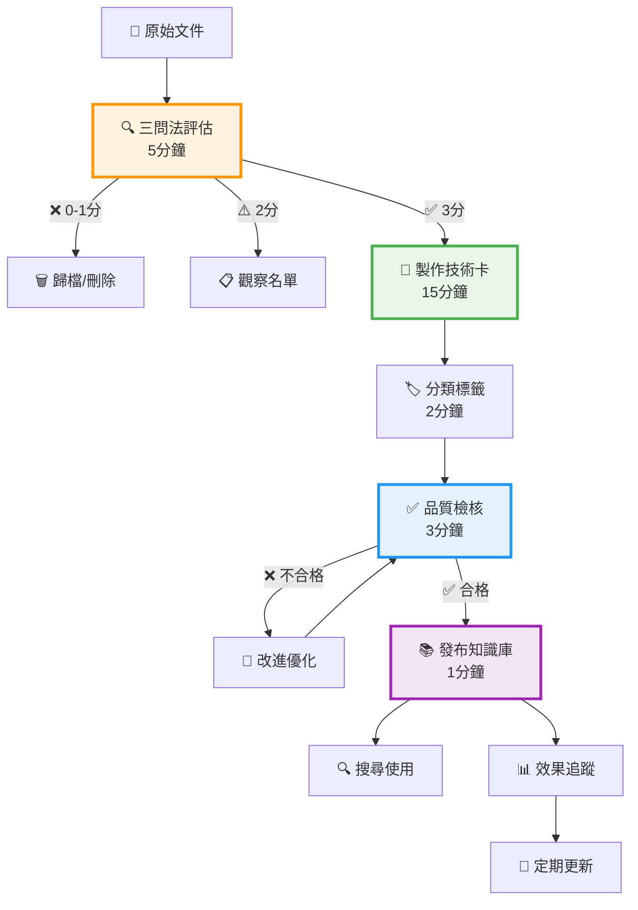
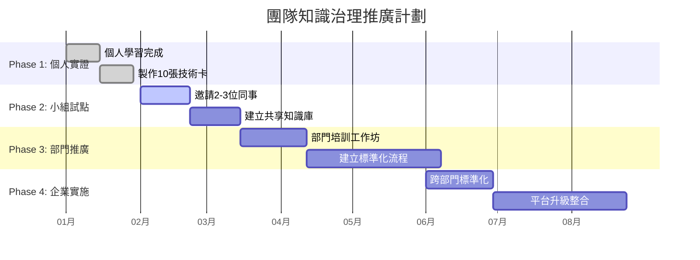

# 📚 企業級檢索增強生成系統：數據治理教學專案

[](https://opensource.org/licenses/MIT)
[](https://www.python.org/downloads/)
[](https://jupyter.org/)

> **設計理念**: 遵循 Linus + Elon 5步驟原則，化繁為簡的企業級知識治理學習之旅

---

## 🎯 專案概述

這是一個關於**企業級檢索增強生成系統 (Enterprise RAG)** 的完整教學專案，結合了AI論文收集系統和企業知識治理課程教材。專案提供兩套學習路徑：**完整版**技術實作和**簡化版**教學系統。

### 🌟 核心特色

- **🔄 雙軌設計**: 完整版技術實作 + 簡化版教學系統
- **📊 實戰導向**: 基於36篇AI發展史關鍵論文的實際案例
- **🎓 漸進學習**: 從5分鐘快速上手到30分鐘深度實踐
- **💡 流程圖核心**: 以視覺化流程圖作為知識萃取關鍵工具

---

## 📁 專案架構

```
data_governance/
│
├── 📊 AI論文收集系統
│   ├── download_papers.py          # 論文下載腳本
│   ├── course_content.md           # 36篇論文清單與摘要
│   └── papers/                     # 分類下載的論文PDF
│       ├── 01_model_paradigm/      # 模型范式變遷 (11篇)
│       ├── 02_infrastructure/      # Infra與資料變遷 (5篇)
│       ├── 03_language_models/     # 語言模型發展 (8篇)
│       └── 04_multimodal/          # 多模態模型發展 (8篇)
│
├── 🎓 企業知識治理教學
│   └── kms_governance/
│       ├── notebooks/
│       │   ├── 完整版/             # 技術實作版本
│       │   │   ├── 01_document_ingestion/
│       │   │   ├── 02_metadata_management/
│       │   │   ├── 03_quality_control/
│       │   │   └── 04_end_to_end_demo/
│       │   │
│       │   └── 簡化版/             # 教學版本 ⭐
│       │       ├── 01_認識你的文件.ipynb      # 5分鐘三問法評估
│       │       ├── 02_一頁式技術卡.ipynb      # 15分鐘技術卡製作
│       │       ├── 03_建立分類標籤.ipynb      # 10分鐘分類架構
│       │       ├── 04_品質自檢表.ipynb        # 10分鐘品質檢核
│       │       ├── 05_從混亂到治理.ipynb      # 20分鐘端到端整合
│       │       ├── 99_進階自動化.ipynb        # 30分鐘自動化策略
│       │       ├── 00_知識萃取核心流程圖.md   # 完整流程圖文檔
│       │       └── README.md                # 學習路徑指南
│       │
│       └── docs/TMF/               # 設計文檔
│           └── 簡化版/
│               ├── 簡化版_設計理念.md          # Elon Musk 5步驟哲學
│               ├── 簡化版_教學設計方案.md      # 完整教學策略
│               └── 階段交付物規格.md           # 六階段交付規範
│
└── 📖 文檔治理參考
    └── docs_document_governance/   # 理論基礎文檔
```

---

## 🚀 快速開始

### 1️⃣ 環境設置

```bash
# 克隆專案
git clone https://github.com/Zenobia000/DATA_GOVERNANCE.git
cd data_governance

# 安裝依賴
pip install -r requirements.txt

# 驗證安裝
python -c "import requests; print('環境設置完成！')"
```

### 2️⃣ 選擇學習路徑

#### 🎓 **簡化版教學系統** (推薦新手)
```bash
# 進入簡化版目錄
cd kms_governance/notebooks/簡化版/

# 啟動 Jupyter
jupyter notebook README.md
```

**⏰ 學習時程**: 總計60分鐘，每天15-20分鐘，一週完成

#### ⚙️ **完整版技術實作** (適合技術人員)
```bash
# 進入完整版目錄
cd kms_governance/notebooks/完整版/

# 啟動 Jupyter
jupyter notebook
```

### 3️⃣ 論文下載系統

```bash
# 下載所有36篇AI關鍵論文
python download_papers.py

# 檢查下載狀態
ls -lR papers/
```

---

## 🎯 簡化版核心課程 (60分鐘完整學習)

### 📊 課程總覽

| 課程 | 時間 | 學習目標 | 核心產出 | 狀態 |
|------|------|----------|----------|------|
| [01_認識你的文件](./kms_governance/notebooks/簡化版/01_認識你的文件.ipynb) | 5分鐘 | 三問法價值判斷 | 文件評估清單 | ✅ |
| [02_一頁式技術卡](./kms_governance/notebooks/簡化版/02_一頁式技術卡.ipynb) | 15分鐘 | 四要素知識濃縮 | 3張技術卡 | ✅ |
| [03_建立分類標籤](./kms_governance/notebooks/簡化版/03_建立分類標籤.ipynb) | 10分鐘 | MECE三層分類 | 分類架構圖 | ✅ |
| [04_品質自檢表](./kms_governance/notebooks/簡化版/04_品質自檢表.ipynb) | 10分鐘 | 五維度品質評估 | 品質檢核SOP | ✅ |
| [05_從混亂到治理](./kms_governance/notebooks/簡化版/05_從混亂到治理.ipynb) | 20分鐘 | 端到端系統建立 | 完整治理流程 | ✅ |
| [99_進階自動化](./kms_governance/notebooks/簡化版/99_進階自動化.ipynb) | 30分鐘 | 三階段自動化策略 | 自動化路線圖 | ⚡ 進階 |

### 🔄 知識萃取核心流程



---

## 📊 AI論文收集系統

### 🧩 四大主題分類

#### 1. 模型范式變遷 (11篇)
- **2004**: Brook for GPUs - 開啟 GPGPU 時代
- **2012**: AlexNet - 深度學習時代開端
- **2017**: Transformer - 注意力機制革命
- **2022**: Chain-of-Thought - 推理型提示奠基

#### 2. Infra與資料變遷 (5篇)
- **2018**: The Bitter Lesson - AI長期哲學指引
- **2019**: ZeRO - 分散式訓練突破
- **2020**: Scaling Laws - LLM規模化理論基礎

#### 3. 語言模型發展 (8篇)
- **2017**: Transformer - 架構基石
- **2018**: BERT - 雙向編碼突破
- **2020**: GPT-3 - 少樣本學習典範
- **2023**: GPT-4 - 多模態能力展現

#### 4. 多模態模型發展 (8篇)
- **2021**: CLIP - 文本圖像理解
- **2022**: Stable Diffusion - 開源生成模型
- **2022**: ChatGPT - 對話式AI突破
- **2023**: Sora - 文本生成視頻

### 📈 論文統計
- **總論文數**: 36篇
- **總引用數**: 約1.2M+ (估計)
- **時間跨度**: 2004-2024 (20年AI發展史)
- **下載成功率**: >90% (排除付費牆)

---

## 🔥 核心設計原則：Elon Musk 5步驟

### 1. 🤔 質疑需求 (01課)
- **原則**: 每個文件都要問「真的需要保存嗎？」
- **工具**: 三問法評估框架
- **口訣**: 「先問為什麼，再決定要不要存」

### 2. 🗑️ 刪除多餘 (02課)
- **原則**: 把冗長報告濃縮成可複用精華
- **工具**: 四要素技術卡框架
- **口訣**: 「一頁說清楚，勝過十頁看不懂」

### 3. 🎯 簡化優化 (03課)
- **原則**: 用最簡邏輯讓知識有唯一歸屬
- **工具**: MECE三層分類架構
- **口訣**: 「簡單分類，快速定位，持續優化」

### 4. ⚡ 加快週期 (04課)
- **原則**: 建立快速有效的品質檢核機制
- **工具**: 五維度品質評估
- **口訣**: 「快速檢核，客觀評估，持續改進」

### 5. 🤖 最後自動化 (99課)
- **原則**: 流程穩定後才考慮工具自動化
- **工具**: 三階段自動化策略
- **口訣**: 「人工流程跑順了，才配擁有自動化」

---

## 🛠️ 技術棧

### 核心依賴
- **Python 3.8+** - 主要開發語言
- **Jupyter Notebook** - 互動式學習環境
- **requests** - HTTP請求處理
- **Mermaid** - 流程圖視覺化

### 完整版額外依賴
- **Docling** - PDF文檔處理 (IBM出品，準確率95%+)
- **sentence-transformers** - 語義嵌入
- **spaCy** - NLP處理
- **asyncio** - 異步處理

### 文件格式支援
- **PDF**: 學術論文、技術文檔
- **Markdown**: 知識卡片、流程文檔
- **Jupyter Notebook**: 互動式教學
- **JSON**: 元數據、配置文件

---

## 📈 學習路徑建議

### 🎯 個人學習路徑 (1週)

```mermaid
gantt
    title 個人知識治理學習計劃
    dateFormat  X
    axisFormat %s

    section 第1天
    01課-認識文件    :done, des1, 0, 5

    section 第2天
    02課-技術卡     :done, des2, 5, 15

    section 第3天
    03課-分類標籤   :done, des3, 15, 10

    section 第4天
    04課-品質檢核   :done, des4, 25, 10

    section 第5天
    05課-系統整合   :done, des5, 35, 20

    section 第6-7天
    實作練習       :active, des6, 55, 20
```



### 👥 團隊推廣路徑 (6個月)



---

## 🎉 成功案例

### ✅ 個人層面檢核
- [ ] 完成5門核心課程學習
- [ ] 製作至少10張高品質技術卡
- [ ] 建立個人知識管理習慣
- [ ] 至少1次成功應用他人技術卡解決問題

### ✅ 團隊層面檢核
- [ ] 2-3人小組試點成功
- [ ] 建立標準化流程與模板
- [ ] 月度知識治理例會運作
- [ ] 團隊知識庫達50+張技術卡

### ✅ 企業層面檢核
- [ ] 跨部門標準化推廣
- [ ] 建立治理委員會與制度
- [ ] 企業知識庫規模500+張
- [ ] 新人學習曲線縮短30%+

---

## 🤝 貢獻指南

### 提交論文建議
1. 確認論文在AI發展史上的重要性
2. 在 `course_content.md` 中添加論文信息
3. 更新 `download_papers.py` 中的 `PAPERS` 列表
4. 測試下載腳本運作正常

### 改進教學內容
1. 在相應的 `.ipynb` 文件中修改
2. 確保保持5-20分鐘的時間控制
3. 更新相關的流程圖
4. 提交 Pull Request

### 報告問題
- 使用 [Issues](https://github.com/Zenobia000/DATA_GOVERNANCE/issues) 回報問題
- 提供詳細的錯誤信息和復現步驟
- 建議改進方案

---

## 📝 更新紀錄

### v2.0.0 (2024-11-17) - 簡化版系統發布
- ✨ 新增簡化版教學系統 (6門課程)
- 🔄 完整流程圖系統建立
- 📊 基於Elon Musk 5步驟的設計重構
- 🎯 60分鐘完整學習路徑

### v1.0.0 (2024-11-11) - 初始版本
- 🚀 論文下載系統建立 (36篇AI關鍵論文)
- 📚 完整版技術實作系統
- 📖 企業知識治理理論基礎
- 🛠️ 基礎架構與工具鏈

---

## 🔑 核心口訣

記住這五句口訣，掌握企業知識治理精髓：

1. **「先問為什麼，再決定要不要存」** - 價值評估
2. **「一頁說清楚，勝過十頁看不懂」** - 內容濃縮
3. **「簡單分類，快速定位，持續優化」** - 分類架構
4. **「快速檢核，客觀評估，持續改進」** - 品質管控
5. **「人工流程跑順了，才配擁有自動化」** - 自動化策略

---

## 📞 聯繫方式

- **GitHub**: [Zenobia000/DATA_GOVERNANCE](https://github.com/Zenobia000/DATA_GOVERNANCE)
- **課程編號**: CS785 - 企業級檢索增強生成系統
- **授權**: MIT License

---

## 🙏 致謝

感謝以下資源和靈感來源：
- **Elon Musk** - 5步驟簡化方法論
- **Linus Torvalds** - 開源協作精神
- **OpenAI, Google, Meta** 等機構的開源論文貢獻
- **IBM Docling** - 優秀的文檔處理工具

---

**🎯 現在就開始你的知識治理學習之旅吧！** 🚀

從 [**簡化版教學系統**](./kms_governance/notebooks/簡化版/README.md) 開始，或直接進入 [**第一課：認識你的文件**](./kms_governance/notebooks/簡化版/01_認識你的文件.ipynb)

---

*📚 課程系列：企業知識治理實戰 | 🏷️ 標籤：RAG系統、知識治理、AI論文、教學系統 | 📅 建立日期：2024-11-17*