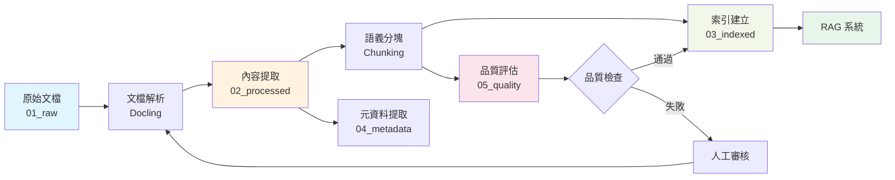

# 企業 KMS 資料治理系統
## Data Governance for Knowledge Management System

> **基於運算思維的資料治理架構設計**
> 為 RAG 系統開發前的前置工作

---

## 🎯 系統目標

在開發 RAG 系統之前，建立完整的資料治理機制，確保：
1. **資料品質** - 高品質、可信賴的知識資產
2. **可追溯性** - 完整的資料血緣與變更歷史
3. **合規性** - 符合企業資訊安全與隱私政策
4. **可發現性** - 結構化的索引與元資料管理

---

## 🧠 運算思維設計方法

### 1. 分解 (Decomposition)

將 KMS 資料治理問題拆解為六大模組：

```
KMS 資料治理
├── 📥 原始文檔收集 (Raw Ingestion)
├── 🔄 文檔處理 (Processing)
├── 📑 索引建立 (Indexing)
├── 🏷️ 元資料管理 (Metadata)
├── ✅ 品質控制 (Quality)
└── 🔗 血緣追蹤 (Lineage)
```

### 2. 模式識別 (Pattern Recognition)

識別企業文檔的共同模式：
- **文檔類型模式**: 論文、報告、手冊、政策
- **結構模式**: 標題、章節、表格、引用
- **命名模式**: `YYYY_DocumentName.pdf`
- **生命週期模式**: 草稿 → 審核 → 發布 → 歸檔

### 3. 抽象化 (Abstraction)

提取關鍵抽象層：
- **文檔實體**: 統一的文檔表示模型
- **元資料模型**: 標準化的元數據schema
- **品質模型**: 多維度品質評估框架
- **治理策略**: 可配置的治理規則引擎

### 4. 演算法設計 (Algorithm Design)

設計自動化流程：
- **文檔解析演算法**: Docling + OCR
- **語義分塊演算法**: 基於 embeddings 的邊界檢測
- **品質評分演算法**: 多維度加權評分
- **血緣追蹤演算法**: DAG 血緣圖建構

---

## 📂 目錄結構

```
kms_governance/
│
├── 01_raw/                      # 原始文檔層
│   ├── papers/                  # 論文 (demo 場域)
│   ├── reports/                 # 報告
│   └── policies/                # 政策文件
│
├── 02_processed/                # 處理後文檔層
│   ├── extracted/               # 提取的內容
│   │   ├── text/                # 純文本
│   │   ├── tables/              # 表格數據
│   │   └── images/              # 圖片
│   └── chunked/                 # 分塊後的內容
│       ├── semantic/            # 語義分塊
│       └── fixed/               # 固定大小分塊
│
├── 03_indexed/                  # 索引層
│   ├── vector_index/            # 向量索引
│   ├── keyword_index/           # 關鍵字索引
│   └── hybrid_index/            # 混合索引
│
├── 04_metadata/                 # 元資料層
│   ├── document_catalog.db      # 文檔目錄 SQLite
│   ├── schemas/                 # 元資料 schema 定義
│   │   ├── paper_schema.json
│   │   ├── report_schema.json
│   │   └── policy_schema.json
│   └── tags/                    # 標籤系統
│       ├── categories.json      # 分類標籤
│       └── keywords.json        # 關鍵字標籤
│
├── 05_quality/                  # 品質控制層
│   ├── reports/                 # 品質報告
│   ├── metrics/                 # 品質指標
│   └── validation/              # 驗證規則
│
├── 06_lineage/                  # 血緣追蹤層
│   ├── dag/                     # 資料血緣圖
│   ├── changelog/               # 變更日誌
│   └── audit/                   # 審計記錄
│
├── utils/                       # 工具模組
│   ├── document_processor.py   # 文檔處理器
│   ├── metadata_extractor.py   # 元數據提取器
│   ├── quality_assessor.py     # 品質評估器
│   └── lineage_tracker.py      # 血緣追蹤器
│
├── notebooks/                   # Jupyter Notebooks
│   ├── 00_architecture_overview.ipynb
│   ├── 01_document_ingestion.ipynb
│   ├── 02_metadata_management.ipynb
│   ├── 03_quality_control.ipynb
│   └── 04_end_to_end_demo.ipynb
│
├── configs/                     # 配置文件
│   ├── governance_policy.yaml
│   ├── quality_thresholds.json
│   └── processing_rules.yaml
│
└── docs/                        # 文檔
    ├── data_dictionary.md       # 數據字典
    ├── governance_guide.md      # 治理指南
    └── api_reference.md         # API 參考
```

---

## 🔄 資料流程 (Data Flow)



---

## 📊 資料治理維度

### 1. 文檔生命週期管理

| 階段 | 狀態 | 自動化操作 |
|------|------|------------|
| 攝取 | `raw` | 格式驗證、病毒掃描 |
| 處理 | `processing` | 內容提取、OCR |
| 審核 | `review` | 品質評估、合規檢查 |
| 發布 | `published` | 索引建立、元數據發布 |
| 歸檔 | `archived` | 壓縮存儲、訪問控制 |
| 淘汰 | `deprecated` | 標記過期、計劃刪除 |

### 2. 元資料管理

#### 核心元資料欄位

```json
{
  "document_id": "string (UUID)",
  "title": "string",
  "authors": ["string"],
  "created_date": "datetime",
  "modified_date": "datetime",
  "document_type": "enum",
  "category": "string",
  "keywords": ["string"],
  "language": "string",
  "quality_score": "float [0-1]",
  "status": "enum",
  "security_level": "enum"
}
```

### 3. 品質維度

基於 ISO 25012 標準：

| 維度 | 權重 | 測量方式 |
|------|------|----------|
| 準確性 (Accuracy) | 0.20 | 拼寫/語法錯誤率 |
| 完整性 (Completeness) | 0.20 | 必需欄位填充率 |
| 一致性 (Consistency) | 0.15 | 格式/術語一致性 |
| 時效性 (Currency) | 0.15 | 文檔年齡 |
| 可理解性 (Understandability) | 0.15 | 可讀性分數 |
| 可追溯性 (Traceability) | 0.15 | 血緣完整性 |

**綜合品質分數**:
```
Q_total = Σ (weight_i × score_i)
```

### 4. 安全與合規

- **訪問控制**: Role-Based Access Control (RBAC)
- **敏感資訊檢測**: PII、機密資訊自動標註
- **審計日誌**: 所有操作完整記錄
- **保留政策**: 自動化的資料保留與刪除

---

## 🚀 快速開始

### 1. 環境設定

```bash
# 安裝依賴
pip install -r requirements.txt

# 初始化資料庫
python utils/init_database.py

# 配置治理規則
cp configs/governance_policy.yaml.template configs/governance_policy.yaml
```

### 2. 執行 Demo

```bash
# 啟動 Jupyter Lab
jupyter lab notebooks/04_end_to_end_demo.ipynb
```

### 3. 批次處理

```python
from utils.document_processor import DocumentProcessor

processor = DocumentProcessor(config_path="configs/governance_policy.yaml")
processor.process_directory("01_raw/papers")
```

---

## 📚 教學目標

### 學習成果

完成本教學後，學生將能夠：

1. **理解資料治理的重要性** - 在 RAG 之前為何需要治理
2. **掌握運算思維** - 應用四大原則解決實際問題
3. **實作治理系統** - 從零建構企業級治理架構
4. **評估資料品質** - 建立多維度品質評估機制
5. **追蹤資料血緣** - 實現完整的資料血緣追蹤

### 課程模組

| 模組 | 時長 | 內容 |
|------|------|------|
| 00 | 30min | 架構概覽與運算思維 |
| 01 | 60min | 文檔攝取與解析 |
| 02 | 60min | 元資料管理 |
| 03 | 60min | 品質控制 |
| 04 | 90min | 端到端 Demo |

---

## 🔧 技術棧

- **文檔處理**: Docling, PyPDF2, python-docx
- **NLP**: spaCy, sentence-transformers
- **資料庫**: SQLite (metadata), ChromaDB (vectors)
- **品質評估**: textstat, language-tool-python
- **可視化**: plotly, networkx
- **Notebook**: Jupyter Lab

---

## 📖 相關資源

- [Ch1 企業知識治理理論](../ch1_document_governance/lectures/01_enterprise_knowledge_governance.md)
- [Docling 官方文檔](https://github.com/DS4SD/docling)
- [ISO 25012 資料品質標準](https://www.iso.org/standard/35736.html)

---

**作者**: Data Governance Team
**版本**: v1.0
**更新日期**: 2025-01-17
**授權**: MIT License
