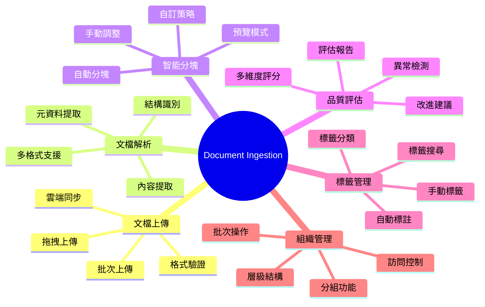

# 智能文檔治理平台 - Document Ingestion 模組產品願景
## Intelligent Document Governance Platform - Document Ingestion Module Product Vision

> **產品使命**: 打造企業級的智能文檔攝取與治理平台，讓非技術用戶也能輕鬆管理複雜的非結構化資料

---

## 🎯 產品願景 (Product Vision)

### 願景聲明
**「讓每個組織都能擁有智能化、可視化的文檔治理能力，將混亂的非結構化資料轉化為有序的知識資產」**

### 核心價值主張 (Value Propositions)

1. **智能化處理** - AI 驅動的文檔解析、分類、品質評估
2. **可視化操作** - 直觀的 UI 界面，無需技術背景
3. **用戶自主** - 用戶可自行調整分塊策略與治理規則
4. **企業級可靠** - 支援大規模處理與嚴格的品質控制

---

## 🎭 目標用戶畫像 (User Personas)

### 主要用戶群體

#### 1. 知識管理專員 (Knowledge Manager)
- **背景**: 企業知識管理部門，負責組織文檔資源
- **痛點**: 手動整理大量文檔耗時，無法確保分類一致性
- **目標**: 自動化文檔分類與標註，建立標準化流程
- **技術水平**: 中等，熟悉辦公軟體但不懂編程

#### 2. 數據分析師 (Data Analyst)
- **背景**: 需要處理文本資料進行分析的專業人員
- **痛點**: 文檔預處理複雜，缺乏統一的品質評估標準
- **目標**: 快速獲得高品質的結構化文本資料
- **技術水平**: 高，熟悉數據工具但希望簡化流程

#### 3. 法規遵循專員 (Compliance Officer)
- **背景**: 負責確保文檔符合行業標準與法規要求
- **痛點**: 難以大規模檢查文檔完整性與合規性
- **目標**: 自動化合規檢查，追蹤文檔處理歷程
- **技術水平**: 低，主要關注業務合規

#### 4. IT 管理員 (IT Administrator)
- **背景**: 負責系統部署、監控、維護的技術人員
- **痛點**: 需要監控系統性能與資料品質
- **目標**: 建立穩定、可監控的文檔處理系統
- **技術水平**: 很高，熟悉系統架構與運維

---

## 🚀 產品功能地圖 (Feature Map)

### Document Ingestion 核心功能域



---

## 📋 Epic 與 Feature 規劃

### Epic 1: 文檔攝取系統 (Document Upload & Processing)

#### Feature 1.1: 多格式文檔上傳
**業務價值**: 支援企業常見的各種文檔格式，降低使用門檻

**功能範圍**:
- 支援 PDF, DOCX, PPTX, TXT, MD, HTML 格式
- 單檔案與批次上傳
- 拖拽式上傳介面
- 上傳進度顯示與錯誤處理
- 檔案大小與格式驗證

#### Feature 1.2: 智能文檔解析
**業務價值**: 自動提取文檔結構與內容，減少手動工作

**功能範圍**:
- 文本內容精確提取
- 表格與圖像識別
- 文檔結構分析（標題、段落、列表）
- 元資料自動提取（作者、建立日期、主題）

#### Feature 1.3: 文檔預覽與初步評估
**業務價值**: 讓用戶在處理前了解文檔品質與結構

**功能範圍**:
- 文檔內容預覽
- 基本統計資訊（字數、頁數、段落數）
- 初步品質評分
- 處理建議與警告

### Epic 2: 智能分塊系統 (Intelligent Chunking)

#### Feature 2.1: 自動智能分塊
**業務價值**: AI 驅動的智能分塊，保持語義完整性

**功能範圍**:
- 語義邊界檢測
- 多種分塊策略（段落、句子、語義）
- 分塊大小自動調整
- 分塊品質評估

#### Feature 2.2: 分塊預覽與編輯
**業務價值**: 用戶可視化查看並調整分塊結果

**功能範圍**:
- 分塊結果可視化展示
- 分塊邊界調整
- 合併/分割分塊
- 分塊內容編輯

#### Feature 2.3: 自訂分塊策略
**業務價值**: 不同業務場景需要不同的分塊策略

**功能範圍**:
- 分塊策略模板
- 自訂分塊規則
- 策略效果評估
- 策略保存與重用

### Epic 3: 標籤與分組系統 (Tagging & Organization)

#### Feature 3.1: 智能標籤系統
**業務價值**: 自動化標註減少手動工作，提升一致性

**功能範圍**:
- 基於內容的自動標註
- 標籤建議與推薦
- 層級標籤結構
- 標籤同義詞管理

#### Feature 3.2: 文檔分組與組織
**業務價值**: 結構化管理大量文檔，提升查找效率

**功能範圍**:
- 動態分組功能
- 多維度分類
- 群組標籤批次操作
- 組織結構可視化

#### Feature 3.3: 協作標註與審核
**業務價值**: 多人協作提升標註品質

**功能範圍**:
- 多用戶協作標註
- 標註衝突解決
- 審核工作流程
- 標註品質評估

### Epic 4: 品質管控與監控 (Quality Control)

#### Feature 4.1: 多維度品質評估
**業務價值**: 確保進入系統的文檔符合品質標準

**功能範圍**:
- ISO 25012 標準評估
- 自訂品質規則
- 品質分數視覺化
- 品質趨勢分析

#### Feature 4.2: 異常檢測與告警
**業務價值**: 即時發現品質問題，防止低品質資料進入系統

**功能範圍**:
- 實時品質監控
- 異常告警機制
- 自動修復建議
- 人工審核流程

---

## 🏃‍♂️ Scrum 實施框架

### Product Backlog 結構

#### 優先級分級 (MoSCoW)

**Must Have (M)** - Sprint 1-2
- Feature 1.1: 多格式文檔上傳
- Feature 1.2: 基礎文檔解析
- Feature 2.1: 基本分塊功能
- Feature 3.1: 基礎標籤功能

**Should Have (S)** - Sprint 3-4
- Feature 1.3: 文檔預覽與評估
- Feature 2.2: 分塊編輯功能
- Feature 3.2: 文檔分組功能
- Feature 4.1: 品質評估

**Could Have (C)** - Sprint 5-6
- Feature 2.3: 自訂分塊策略
- Feature 3.3: 協作標註
- Feature 4.2: 異常檢測

**Won't Have (W)** - 未來版本
- 高級 AI 模型整合
- 多語言 NLP 支援
- 企業級 SSO 整合

### 團隊角色定義

- **Product Owner**: 定義業務需求與優先順序
- **Scrum Master**: 協調開發流程與移除障礙
- **開發團隊**:
  - Frontend Developer (React/Vue)
  - Backend Developer (Python/FastAPI)
  - ML Engineer (NLP/AI)
  - DevOps Engineer (Docker/K8s)
  - QA Engineer (自動化測試)

---

## 📊 成功指標 (Success Metrics)

### 產品指標 (Product Metrics)

#### 用戶採用指標
- **月活用戶數 (MAU)**: 目標 500+ 用戶
- **文檔處理量**: 目標 10,000+ 文檔/月
- **用戶留存率**: 目標 85%+ (30天)

#### 功能使用指標
- **自動分塊採用率**: 目標 70%+
- **標籤使用率**: 目標 80%+ 文檔有標籤
- **品質通過率**: 目標 90%+ 文檔通過品質檢查

#### 業務價值指標
- **處理效率提升**: 目標 5x 人工處理速度
- **品質一致性**: 目標 95%+ 標註一致性
- **用戶滿意度**: 目標 4.5/5.0 分

### 技術指標 (Technical Metrics)

#### 性能指標
- **文檔處理速度**: 目標 < 5 秒/文檔
- **系統可用性**: 目標 99.5%+ 運行時間
- **API 響應時間**: 目標 < 200ms P95

#### 品質指標
- **處理準確率**: 目標 95%+ 成功處理
- **錯誤恢復率**: 目標 < 1% 不可恢復錯誤
- **測試覆蓋率**: 目標 85%+ 代碼覆蓋

---

## 🔄 敏捷開發流程

### Sprint 規劃 (2週 Sprint)

#### Sprint 時間框架
- **Sprint 0**: 環境設置與基礎架構 (2週)
- **Sprint 1-2**: MVP 核心功能 (4週)
- **Sprint 3-4**: 進階功能與優化 (4週)
- **Sprint 5-6**: 整合測試與上線準備 (4週)

### Definition of Ready (DoR)
✅ 用戶故事已定義且可理解
✅ 驗收條件已明確列出
✅ 技術依賴已識別
✅ 工作量已估算 (Story Points)
✅ UI/UX 設計已完成 (如需要)
✅ API 規格已定義 (如需要)

### Definition of Done (DoD)
✅ 代碼已實作並通過 Code Review
✅ 單元測試覆蓋率 ≥ 80%
✅ 整合測試通過
✅ 用戶驗收測試通過
✅ 文檔已更新
✅ 部署到測試環境成功
✅ 性能符合需求

---

## 💡 創新特色設計

### 差異化競爭優勢

1. **視覺化分塊編輯器** - 類似 Notion 的塊狀編輯體驗
2. **AI 輔助標註** - 結合 LLM 進行智能標籤推薦
3. **協作式品質管控** - 多人協作的文檔品質提升
4. **可解釋的 AI 決策** - 解釋為什麼這樣分塊與標註

### 技術創新點

1. **混合分塊策略** - 結合規則與 AI 的分塊算法
2. **實時品質監控** - 即時反饋文檔品質變化
3. **自適應學習** - 系統從用戶操作中學習偏好
4. **多模態理解** - 文本、圖表、表格統一處理

---

## 🎨 用戶體驗設計原則

### UX 設計哲學

1. **簡潔優先** - 複雜功能簡化為直觀操作
2. **即時反饋** - 每個操作都有清晰的狀態提示
3. **容錯設計** - 用戶操作錯誤時提供明確指導
4. **漸進式揭示** - 高級功能不影響基礎使用

### 關鍵用戶旅程

#### 新用戶首次使用
1. **歡迎引導** - 5分鐘快速教學
2. **範例文檔** - 預載範例展示功能
3. **成功體驗** - 確保第一次使用成功
4. **進階指導** - 逐步解鎖高級功能

#### 日常使用流程
1. **快速上傳** - 一鍵上傳與處理
2. **結果預覽** - 即時查看處理結果
3. **調整優化** - 簡單調整分塊與標籤
4. **批次操作** - 高效處理多個文檔

---

## 🔧 技術架構概覽

### 系統架構圖

```
前端層 (Frontend)
├── React/Vue SPA
├── 可視化組件庫
├── 實時通訊 (WebSocket)
└── 狀態管理 (Redux/Vuex)

API 層 (API Gateway)
├── FastAPI REST API
├── GraphQL (查詢優化)
├── WebSocket (實時更新)
└── 認證授權 (OAuth 2.0)

業務邏輯層 (Business Logic)
├── 文檔處理引擎
├── 分塊算法引擎
├── 品質評估引擎
└── 標籤管理引擎

資料層 (Data Layer)
├── PostgreSQL (元資料)
├── ChromaDB (向量索引)
├── Redis (快取)
└── MinIO (文檔存儲)

基礎設施層 (Infrastructure)
├── Docker 容器化
├── Kubernetes 編排
├── Prometheus 監控
└── CI/CD 管線
```

### 關鍵技術選型

| 層級 | 技術棧 | 選型理由 |
|------|---------|-----------|
| 前端 | React + TypeScript | 組件化開發，生態成熟 |
| 後端 | FastAPI + Python | 高性能，原生支援 ML |
| 資料庫 | PostgreSQL | 企業級可靠性 |
| 向量DB | ChromaDB | 輕量級，易整合 |
| 檔案存儲 | MinIO | S3 兼容，自託管 |
| 容器化 | Docker + K8s | 雲原生標準 |
| 監控 | Prometheus + Grafana | 開源監控標準 |

---

## 📈 商業模式與路線圖

### 商業模式

#### 目標市場
- **主要市場**: 中大型企業 (員工 500+)
- **次級市場**: 法律、醫療、金融等文檔密集行業
- **長期市場**: 中小企業 SaaS 服務

#### 收入模式
- **基礎版**: 免費，限制文檔數量與功能
- **專業版**: 月費制，完整功能
- **企業版**: 年費制，私有部署 + 技術支援

### 產品路線圖

#### Phase 1: MVP (3個月)
- 基礎文檔上傳與處理
- 簡單分塊與標註
- Web 界面原型

#### Phase 2: 進階功能 (6個月)
- 智能分塊與品質評估
- 協作功能與權限管理
- 性能優化與穩定性

#### Phase 3: 企業級 (12個月)
- 高級 AI 功能
- 企業整合 (SSO, LDAP)
- 多租戶架構

#### Phase 4: 生態擴展 (18個月)
- RAG 系統整合
- 第三方工具整合
- 開放平台 API

---

## 🎯 關鍵成功因素

### 產品成功要素

1. **用戶體驗**: 直觀易用的界面設計
2. **處理品質**: 高準確率的文檔解析與分塊
3. **系統性能**: 快速響應與大規模處理能力
4. **可靠性**: 企業級的穩定性與安全性

### 風險與緩解策略

| 風險 | 影響 | 機率 | 緩解策略 |
|------|------|------|----------|
| 技術複雜度過高 | 高 | 中 | 分階段實作，MVP 優先 |
| 用戶採用率低 | 高 | 中 | 強化 UX 設計，用戶測試 |
| 競爭對手快速跟進 | 中 | 高 | 專注差異化功能 |
| 資料安全合規 | 高 | 低 | 早期整合安全設計 |

---

## 🔮 未來發展方向

### 長期願景

1. **AI Native Platform** - 深度整合大語言模型
2. **多模態處理** - 支援圖像、音頻、視頻
3. **知識圖譜** - 構建企業知識網絡
4. **智能助手** - AI 驅動的文檔管理助手

### 技術演進路線

- **近期**: 基於傳統 ML/NLP 技術
- **中期**: 整合預訓練大模型
- **長期**: 自研領域專用模型

---

**文檔版本**: v1.0
**建立日期**: 2024-01-17
**負責人**: 產品架構團隊
**審核狀態**: 待審核

> 💡 **下一步**: 基於此願景進行詳細的 User Story 設計與技術規格制定