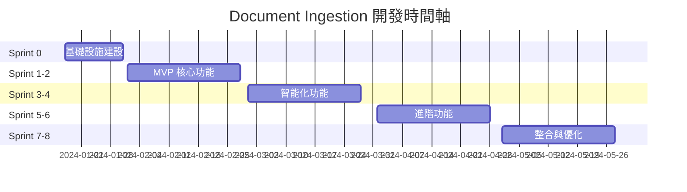
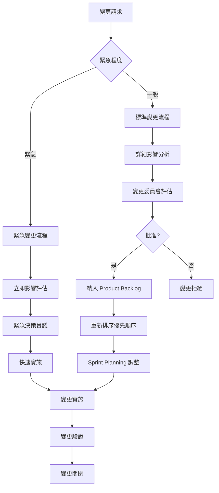

# Document Ingestion Sprint 規劃與優先順序
## Sprint Planning & Prioritization - Document Ingestion Module

> **Scrum 實施**: 詳細的 Sprint 規劃、優先順序評估與風險管理

---

## 🎯 Sprint 規劃總覽

### 專案時間軸 (16週完整開發週期)



### 團隊 Velocity 基準

#### 團隊組成與 Capacity
```yaml
Team Composition (6人):
  - Product Owner: 1人 (20% 開發時間)
  - Scrum Master: 1人 (100% 協調時間)
  - Frontend Developer: 1人 (Story Points: 8-10/sprint)
  - Backend Developer: 1人 (Story Points: 10-12/sprint)
  - ML Engineer: 1人 (Story Points: 6-8/sprint)
  - QA Engineer: 1人 (Story Points: 6-8/sprint)

Total Estimated Velocity: 30-38 Story Points/Sprint
Buffer for Risk: 20%
Target Velocity: 25-30 Story Points/Sprint
```

---

## 🏃‍♂️ 詳細 Sprint 規劃

### Sprint 0: 基礎設施建設 (2024/01/17 - 01/31)

#### Sprint 目標
**「建立穩定可擴展的開發與部署基礎設施，為後續功能開發提供強力支撐」**

#### 主要 Deliverables

##### 開發環境 (5 Story Points)
- [ ] **Docker Compose 開發環境** (2 points)
  - PostgreSQL + Redis + MinIO 容器設定
  - 熱重載開發環境
  - 環境變數管理

- [ ] **代碼庫結構建立** (2 points)
  - Monorepo vs Microrepo 決策
  - 代碼風格與 linting 設定
  - Pre-commit hooks 配置

- [ ] **本地測試環境** (1 point)
  - 測試資料庫設定
  - Mock 服務設定
  - 測試檔案準備

##### CI/CD 管線 (8 Story Points)
- [ ] **GitHub Actions 設定** (3 points)
  - 自動測試管線
  - 代碼品質檢查
  - 安全掃描整合

- [ ] **Docker 映像建構** (2 points)
  - 多階段建構最佳化
  - 映像大小優化
  - 安全性強化

- [ ] **Kubernetes 部署設定** (3 points)
  - Helm Charts 建立
  - 環境配置管理
  - 滾動更新策略

##### 監控與日誌 (5 Story Points)
- [ ] **Prometheus + Grafana 設定** (2 points)
  - 基礎系統指標收集
  - 應用指標定義
  - 告警規則設定

- [ ] **ELK Stack 設定** (2 points)
  - Elasticsearch + Logstash + Kibana
  - 結構化日誌設計
  - 日誌聚合與分析

- [ ] **分散式追蹤** (1 point)
  - Jaeger 設定
  - OpenTelemetry 整合
  - 追蹤資料分析

**Sprint 0 風險**:
- **高**: 團隊對 K8s 不熟悉 → 緩解: 提供訓練，簡化部署
- **中**: Docker 建構時間長 → 緩解: 多階段建構，快取層
- **低**: 監控配置複雜 → 緩解: 使用預設配置，逐步客製化

---

### Sprint 1: MVP 核心功能 - Phase 1 (2024/02/01 - 02/14)

#### Sprint 目標
**「實現文檔上傳、基礎解析、簡單分塊的 MVP，讓用戶能完成基本的文檔處理流程」**

#### Sprint Backlog

##### 高優先級 Stories (Must Have)

###### US-1.1.1: 基礎文檔上傳 (5 points)
**負責人**: Backend Developer + Frontend Developer

**技術任務分解**:
- [ ] **後端實作** (3 points)
  - FastAPI 檔案上傳端點
  - 檔案格式驗證中間件
  - 檔案存儲到 MinIO
  - 基礎元資料提取

- [ ] **前端實作** (2 points)
  - React 檔案上傳組件
  - 拖拽上傳功能
  - 上傳進度顯示
  - 錯誤處理 UI

**驗收標準**:
✅ 支援 PDF, DOCX, TXT 上傳
✅ 檔案大小限制 50MB
✅ 拖拽上傳功能
✅ 上傳進度即時顯示
✅ 錯誤信息清晰顯示

**Definition of Done**:
- [ ] 功能實作完成
- [ ] 單元測試覆蓋率 > 80%
- [ ] 整合測試通過
- [ ] Code Review 完成
- [ ] 部署到開發環境

###### US-1.2.1: 文本內容提取 (8 points)
**負責人**: Backend Developer + ML Engineer

**技術任務分解**:
- [ ] **PDF 處理引擎** (3 points)
  - Docling 整合與配置
  - OCR 處理能力
  - 錯誤處理與降級

- [ ] **DOCX 處理引擎** (2 points)
  - python-docx 整合
  - 格式保留邏輯
  - 表格與圖片處理

- [ ] **內容清理與正規化** (2 points)
  - 文本清理算法
  - 編碼問題處理
  - 格式統一化

- [ ] **處理任務隊列** (1 point)
  - Celery 非同步處理
  - 任務狀態追蹤
  - 重試機制

**驗收標準**:
✅ PDF 文本提取準確率 > 95%
✅ DOCX 格式保留度 > 90%
✅ 處理時間 < 10秒/文檔
✅ 錯誤處理與重試機制
✅ OCR 處理能力

###### US-1.3.1: 文檔快速預覽 (3 points)
**負責人**: Frontend Developer

**技術任務分解**:
- [ ] **預覽組件開發** (2 points)
  - 文本預覽顯示
  - 基本統計資訊
  - 搜尋高亮功能

- [ ] **預覽 API 整合** (1 point)
  - 快速內容提取 API
  - 統計資訊計算
  - 預覽快取機制

**驗收標準**:
✅ 顯示文檔前 1000 字
✅ 基本統計資訊準確
✅ 預覽載入時間 < 3秒
✅ 搜尋高亮功能

###### US-2.1.1: 基礎分塊功能 (8 points)
**負責人**: ML Engineer + Backend Developer

**技術任務分解**:
- [ ] **分塊算法實作** (3 points)
  - 段落分塊算法
  - 固定大小分塊
  - 分塊邊界檢測

- [ ] **分塊配置系統** (2 points)
  - 分塊參數管理
  - 配置驗證邏輯
  - 預設策略定義

- [ ] **分塊結果存儲** (2 points)
  - 資料庫 Schema 實作
  - 分塊 CRUD 操作
  - 分塊統計計算

- [ ] **分塊 API 開發** (1 point)
  - RESTful API 端點
  - 請求驗證
  - 響應格式標準化

**驗收標準**:
✅ 支援段落與固定大小分塊
✅ 分塊大小可配置 (100-800字)
✅ 分塊邊界保持句子完整
✅ 分塊統計資訊準確

##### 中優先級 Stories (Should Have)

###### US-5.1.1: 基礎 CRUD 操作 (5 points)
**負責人**: Backend Developer + Frontend Developer

**技術任務分解**:
- [ ] **文檔管理 API** (3 points)
  - 文檔列表查詢 (分頁、過濾、排序)
  - 文檔詳細資訊查詢
  - 文檔更新與刪除

- [ ] **前端管理介面** (2 points)
  - 文檔列表組件
  - 文檔詳情頁面
  - 編輯與刪除操作

**驗收標準**:
✅ 文檔列表支援分頁與搜尋
✅ 文檔詳情完整顯示
✅ 編輯功能正常運作
✅ 軟刪除機制

#### Sprint 1 風險評估

| 風險項目 | 機率 | 影響 | 緩解策略 | 負責人 |
|----------|------|------|----------|---------|
| Docling 整合困難 | 中 | 高 | 準備 PyPDF2 備案 | ML Engineer |
| 前端組件複雜度 | 低 | 中 | 使用成熟 UI 庫 | Frontend Developer |
| 效能未達標 | 中 | 中 | 分階段優化 | 整個團隊 |
| 第三方依賴問題 | 低 | 高 | 版本鎖定 + 備案 | Backend Developer |

#### Sprint 1 成功標準
- [ ] 完成 25+ Story Points
- [ ] 所有 Must Have 功能 100% 完成
- [ ] 代碼覆蓋率 > 75%
- [ ] 用戶可完成端到端文檔處理流程
- [ ] 系統性能達到基準要求

---

### Sprint 2: MVP 核心功能 - Phase 2 (2024/02/15 - 02/28)

#### Sprint 目標
**「完善核心處理能力，增加批次處理與基礎品質控制，提升系統實用性」**

#### Sprint Backlog

##### US-1.1.2: 批次文檔上傳 (8 points)
**負責人**: Backend Developer + Frontend Developer

**技術任務**:
- [ ] **批次上傳 API** (4 points)
  - 多檔案上傳處理
  - 批次任務隊列管理
  - 進度追蹤 API
  - WebSocket 即時更新

- [ ] **批次上傳 UI** (4 points)
  - 多檔案選擇器
  - 批次進度顯示
  - 失敗檔案處理
  - 批次操作控制

**驗收標準**:
✅ 支援一次上傳 20 個檔案
✅ 批次進度即時顯示
✅ 部分失敗不影響其他檔案
✅ 批次操作可暫停/取消

##### US-1.2.3: 元資料自動提取 (8 points)
**負責人**: ML Engineer + Backend Developer

**技術任務**:
- [ ] **NLP 元資料提取** (4 points)
  - spaCy NER 整合
  - 文檔分類器
  - 關鍵詞提取算法
  - 語言檢測

- [ ] **元資料驗證與增強** (2 points)
  - 元資料品質檢查
  - 缺失元資料推斷
  - 元資料標準化

- [ ] **元資料管理 API** (2 points)
  - 元資料 CRUD 操作
  - 元資料搜尋功能
  - 元資料匯出功能

**驗收標準**:
✅ 自動提取作者、日期、類型
✅ 關鍵詞提取準確率 > 80%
✅ 文檔分類準確率 > 85%
✅ 元資料完整性檢查

##### US-1.3.2: 品質初步評估 (8 points)
**負責人**: ML Engineer + Backend Developer

**技術任務**:
- [ ] **多維度品質算法** (4 points)
  - ISO 25012 標準實作
  - 品質分數計算
  - 品質問題檢測
  - 改進建議生成

- [ ] **品質評估 API** (2 points)
  - 品質評估端點
  - 品質歷史追蹤
  - 品質報告生成

- [ ] **品質可視化** (2 points)
  - 品質分數儀表板
  - 雷達圖組件
  - 趨勢圖表

**驗收標準**:
✅ 六大品質維度評估
✅ 綜合品質分數 0-100
✅ 品質問題自動檢測
✅ 可視化品質報告

##### US-3.1.1: 自動標籤生成 (8 points)
**負責人**: ML Engineer

**技術任務**:
- [ ] **標籤生成引擎** (5 points)
  - TF-IDF 關鍵詞提取
  - TextRank 關鍵短語
  - 實體標籤生成
  - 主題模型標籤

- [ ] **標籤品質控制** (2 points)
  - 標籤相關性評分
  - 重複標籤合併
  - 標籤標準化

- [ ] **標籤管理 API** (1 point)
  - 標籤 CRUD 操作
  - 標籤階層管理
  - 標籤統計功能

**驗收標準**:
✅ 自動生成 5-15 個相關標籤
✅ 標籤信心度 > 75%
✅ 支援層級標籤結構
✅ 標籤去重與標準化

#### Sprint 2 容量規劃
- **總工作量**: 32 Story Points
- **團隊容量**: 30 Points
- **風險緩衝**: 2 Points 超出 (可調整範圍)

#### Sprint 2 風險與緩解

| 風險項目 | 機率 | 影響 | 緩解策略 |
|----------|------|------|----------|
| ML 模型效果不佳 | 中 | 高 | 多模型對比，降低期望 |
| 批次處理性能問題 | 中 | 中 | 分段處理，非同步隊列 |
| UI 複雜度高於預期 | 低 | 中 | 簡化 UI，分階段實作 |

---

### Sprint 3: 智能化功能提升 (2024/03/01 - 03/14)

#### Sprint 目標
**「提升系統智能化水平，實現語義分塊與進階標籤功能，增強用戶體驗」**

#### Sprint Backlog

##### US-1.2.2: 結構化資訊提取 (13 points)
**負責人**: ML Engineer + Backend Developer (跨 Sprint 3-4)

**Sprint 3 部分** (7 points):
- [ ] **文檔結構分析** (3 points)
  - 標題層級識別
  - 段落結構分析
  - 列表結構提取

- [ ] **表格提取基礎** (2 points)
  - 表格邊界檢測
  - 基礎內容提取
  - 結構化存儲

- [ ] **圖片識別基礎** (2 points)
  - 圖片位置檢測
  - Alt 文字提取
  - 圖片類型分類

##### US-2.1.2: 語義智能分塊 (13 points)
**負責人**: ML Engineer

**技術任務**:
- [ ] **語義嵌入整合** (5 points)
  - SentenceTransformers 整合
  - 多模型支援架構
  - 嵌入向量快取

- [ ] **語義邊界檢測** (4 points)
  - 相似度計算算法
  - 邊界檢測邏輯
  - 閾值自動調整

- [ ] **分塊品質評估** (2 points)
  - 語義完整性評分
  - 分塊品質指標
  - 品質反饋機制

- [ ] **分塊策略選擇** (2 points)
  - 多策略支援
  - 自動策略推薦
  - 策略效果比較

**驗收標準**:
✅ 語義相似度計算準確
✅ 邊界檢測準確率 > 85%
✅ 語義完整性 > 90%
✅ 多種分塊策略支援

##### US-2.2.1: 分塊可視化預覽 (8 points)
**負責人**: Frontend Developer

**技術任務**:
- [ ] **分塊卡片組件** (3 points)
  - 分塊內容顯示
  - 統計資訊顯示
  - 品質分數可視化

- [ ] **相似度視覺化** (3 points)
  - 分塊間相似度熱力圖
  - 語義關聯性顯示
  - 互動式探索

- [ ] **分塊導航與搜尋** (2 points)
  - 分塊快速跳轉
  - 分塊內容搜尋
  - 分塊過濾功能

**驗收標準**:
✅ 分塊卡片清晰顯示
✅ 相似度視覺化直觀
✅ 搜尋與導航順暢
✅ 響應式設計支援

#### Sprint 3 容量檢查
- **規劃工作量**: 28 Story Points (在容量範圍內)
- **風險評估**: 中等風險，需密切監控
- **調整空間**: 如進度落後，可將 US-1.2.2 部分移到 Sprint 4

---

### Sprint 4: 用戶體驗優化 (2024/03/15 - 03/28)

#### Sprint 目標
**「完善用戶操作體驗，實現分塊編輯與文檔組織功能，達到產品可用性標準」**

#### Sprint Backlog

##### US-1.2.2: 結構化資訊提取 - 完成 (6 points)
**剩餘工作**:
- [ ] **進階表格處理** (2 points)
- [ ] **圖片內容分析** (2 points)
- [ ] **結構化資料整合** (2 points)

##### US-2.2.2: 分塊邊界調整 (13 points)
**負責人**: Frontend Developer + Backend Developer

**技術任務**:
- [ ] **拖拽邊界調整** (5 points)
  - 拖拽交互實作
  - 邊界檢測邏輯
  - 即時預覽更新

- [ ] **分塊合併分割** (4 points)
  - 合併操作 API
  - 分割操作 API
  - 操作歷史記錄

- [ ] **邊界自動調整** (2 points)
  - 語義邊界自動對齊
  - 句子完整性保持
  - 調整建議提示

- [ ] **批次邊界操作** (2 points)
  - 多分塊選擇
  - 批次邊界調整
  - 批次操作確認

##### US-3.2.1: 動態分組功能 (8 points)
**負責人**: Frontend Developer + Backend Developer

**技術任務**:
- [ ] **分組資料模型** (2 points)
  - 階層分組結構
  - 分組權限管理
  - 分組統計追蹤

- [ ] **分組管理 API** (3 points)
  - 分組 CRUD 操作
  - 文檔分組關聯
  - 分組移動操作

- [ ] **分組管理 UI** (3 points)
  - 樹狀分組顯示
  - 拖拽分組操作
  - 分組統計可視化

##### US-1.1.3: 雲端同步上傳 (3 points - 簡化實作)
**負責人**: Backend Developer

**簡化範圍**:
- [ ] **Google Drive 基礎整合** (3 points)
  - OAuth 認證流程
  - 基礎檔案同步
  - 同步狀態顯示

#### Sprint 4 調整策略
- **工作量**: 30 Story Points (符合容量)
- **彈性安排**: 如 Sprint 3 超時，優先完成核心功能
- **品質關注**: 加強整合測試與用戶驗收測試

---

### Sprint 5-6: 進階功能開發 (2024/04/01 - 04/28)

#### Sprint 5 目標
**「實現進階 AI 功能與協作特性，提升系統智能化程度」**

#### Sprint 6 目標
**「完善品質監控與異常檢測，建立企業級可靠性」**

#### 主要功能 (合併規劃)

##### 高級 AI 功能
- [ ] **US-2.1.3: 多策略分塊引擎** (21 points)
- [ ] **US-3.1.3: 智能標籤推薦** (21 points)
- [ ] **US-4.1.1: 多維度品質評估** (13 points)

##### 協作與管理功能
- [ ] **US-3.3.1: 協作標註功能** (13 points)
- [ ] **US-5.1.2: 版本控制與歷史** (13 points)
- [ ] **US-4.1.2: 品質問題檢測** (8 points)

##### 系統優化
- [ ] **性能優化** (8 points)
- [ ] **安全性強化** (5 points)
- [ ] **監控完善** (5 points)

---

## 📊 優先順序評估框架

### 優先順序矩陣 (Value vs Effort)

```
高價值 |  ⭐ US-1.1.1    |  🎯 US-1.2.1
      |  ⭐ US-2.1.1    |  🎯 US-2.1.2
      |  ⭐ US-1.3.1    |  🎯 US-3.1.1
      |__________________|__________________
      |  📋 US-1.1.2    |  🔮 US-2.1.3
      |  📋 US-1.3.2    |  🔮 US-3.1.3
低價值 |  📋 US-5.1.1    |  🔮 US-1.1.3
      |__________________|__________________
        低工作量           高工作量

圖例:
⭐ Quick Wins (高價值低工作量) - Sprint 1 優先
🎯 Major Projects (高價值高工作量) - Sprint 2-3 核心
📋 Fill-ins (低價值低工作量) - Sprint 後期填充
🔮 Questionable (低價值高工作量) - 暫緩或重新評估
```

### 優先順序評分機制

#### 評分維度 (總分 100)
```yaml
Business Value (40%):
  user_impact: 15%        # 用戶影響度
  revenue_impact: 10%     # 營收影響
  strategic_alignment: 10% # 策略符合度
  competitive_advantage: 5% # 競爭優勢

Technical Factors (30%):
  implementation_risk: 10% # 實作風險
  technical_debt: 5%      # 技術債務影響
  performance_impact: 5%  # 性能影響
  maintenance_cost: 10%   # 維護成本

User Experience (20%):
  usability: 10%          # 易用性
  accessibility: 5%       # 可及性
  user_satisfaction: 5%   # 用戶滿意度

Constraints (10%):
  timeline_pressure: 5%   # 時間壓力
  resource_availability: 5% # 資源可用性
```

#### 評分示例

##### US-1.1.1: 基礎文檔上傳
```yaml
Business Value: 38/40
  user_impact: 15/15      # 核心功能，影響所有用戶
  revenue_impact: 8/10    # 直接影響產品可用性
  strategic_alignment: 10/10 # 完全符合產品策略
  competitive_advantage: 5/5  # 基礎功能

Technical Factors: 25/30
  implementation_risk: 8/10   # 風險較低，技術成熟
  technical_debt: 5/5        # 不產生技術債務
  performance_impact: 4/5     # 性能影響適中
  maintenance_cost: 8/10      # 維護成本可控

User Experience: 18/20
  usability: 9/10            # 高度易用性
  accessibility: 4/5         # 良好的可及性
  user_satisfaction: 5/5     # 高用戶滿意度

Constraints: 10/10
  timeline_pressure: 5/5     # 時間充足
  resource_availability: 5/5 # 資源充足

總分: 91/100 (第一優先)
```

##### US-2.1.3: 多策略分塊引擎
```yaml
Business Value: 28/40
  user_impact: 10/15         # 進階功能，影響部分用戶
  revenue_impact: 6/10       # 間接影響
  strategic_alignment: 8/10  # 符合長期策略
  competitive_advantage: 4/5 # 差異化功能

Technical Factors: 18/30
  implementation_risk: 5/10  # 風險較高，技術複雜
  technical_debt: 3/5       # 可能產生技術債務
  performance_impact: 3/5    # 性能影響較大
  maintenance_cost: 7/10     # 維護成本較高

User Experience: 15/20
  usability: 7/10           # 易用性需要設計
  accessibility: 4/5        # 可及性良好
  user_satisfaction: 4/5    # 滿意度較高

Constraints: 6/10
  timeline_pressure: 3/5    # 時間壓力較大
  resource_availability: 3/5 # 需要 ML 專家

總分: 67/100 (第四優先)
```

---

## 🎯 Sprint 目標與成功標準

### Sprint 成功標準模板

#### 功能完成度標準
```yaml
Sprint Success Criteria:
  # 功能完成度
  story_completion:
    target: 100% Must Have stories
    acceptable: 90% Must Have + 80% Should Have
    minimum: 85% Must Have stories

  # 品質標準
  quality_gates:
    code_coverage: ">= 80%"
    bug_count: "<= 2 critical, <= 5 major"
    performance: "All endpoints < 2x baseline"
    security: "Zero high-severity vulnerabilities"

  # 用戶驗收
  user_acceptance:
    uat_pass_rate: ">= 95%"
    user_satisfaction: ">= 4.0/5.0"
    task_completion_rate: ">= 90%"

  # 技術指標
  technical_health:
    build_success_rate: ">= 98%"
    deployment_success: "100%"
    test_execution_time: "<= 15 minutes"
    documentation_coverage: ">= 90%"
```

### 每日 Scrum 追蹤指標

#### 燃盡圖監控
```python
class SprintMetrics:
    """Sprint 指標追蹤"""

    def calculate_burndown(self, sprint_id: str) -> Dict:
        """計算燃盡圖資料"""
        sprint_data = self.get_sprint_data(sprint_id)

        return {
            'planned_capacity': sprint_data['total_story_points'],
            'daily_progress': [
                {
                    'date': date,
                    'remaining_points': remaining,
                    'completed_points': completed,
                    'ideal_remaining': ideal_line[day]
                }
                for day, (date, remaining, completed) in enumerate(sprint_data['daily_data'])
            ],
            'velocity_trend': self.calculate_velocity_trend(sprint_id),
            'completion_forecast': self.forecast_completion_date(sprint_id)
        }

    def track_daily_impediments(self, impediments: List[Dict]) -> Dict:
        """追蹤每日阻礙"""
        return {
            'total_impediments': len(impediments),
            'resolution_time_avg': np.mean([i['resolution_hours'] for i in impediments if i.get('resolved')]),
            'impact_categories': self._categorize_impediments(impediments),
            'action_items': self._generate_action_items(impediments)
        }
```

---

## 🔄 Retrospective 與持續改進

### Retrospective 會議結構

#### 會議流程 (90分鐘)
```yaml
Sprint Retrospective Agenda:

  1. Check-in (5分鐘):
     - 團隊成員心情狀態
     - Sprint 整體感受評分 (1-5)

  2. 資料回顧 (15分鐘):
     - Sprint 指標檢視
     - Velocity 趨勢分析
     - 品質指標回顧

  3. What Went Well (20分鐘):
     - 成功經驗分享
     - 有效實踐識別
     - 值得保持的做法

  4. What Didn't Go Well (20分鐘):
     - 問題與挑戰識別
     - 根本原因分析
     - 影響評估

  5. What We Learned (15分鐘):
     - 新知識與技能
     - 經驗教訓總結
     - 最佳實踐更新

  6. Action Items (15分鐘):
     - 改進行動制定
     - 負責人指派
     - 完成時間設定
     - 成功標準定義
```

#### 改進追蹤機制

##### 改進行動追蹤表
```yaml
Improvement Action Template:
  action_id: "IMP_001"
  description: "改善代碼審查流程"
  category: "process_improvement"
  priority: "high"

  owner: "團隊 Tech Lead"
  assigned_date: "2024-02-14"
  target_completion: "2024-02-28"

  success_criteria:
    - "代碼審查平均時間 < 4 小時"
    - "審查品質評分 > 4.0/5.0"
    - "團隊滿意度提升"

  status: "in_progress"
  progress_notes:
    - "2024-02-20: 建立審查檢查清單"
    - "2024-02-22: 團隊培訓完成"

  completion_evidence:
    - metrics_improvement: true
    - team_feedback: "positive"
    - measurable_impact: "25% 審查時間減少"
```

### 技術債務管理

#### 技術債務追蹤
```python
class TechnicalDebtTracker:
    """技術債務追蹤器"""

    DEBT_CATEGORIES = {
        'code_quality': {
            'weight': 3,
            'examples': ['複雜函數', '重複代碼', '缺乏測試']
        },
        'architecture': {
            'weight': 5,
            'examples': ['緊耦合', '循環依賴', '層級混亂']
        },
        'performance': {
            'weight': 4,
            'examples': ['慢查詢', 'N+1問題', '記憶體洩漏']
        },
        'security': {
            'weight': 5,
            'examples': ['弱密碼', '未加密資料', '權限漏洞']
        }
    }

    def calculate_debt_score(self, issues: List[Dict]) -> float:
        """計算技術債務分數"""
        total_weight = 0
        total_score = 0

        for issue in issues:
            category = issue['category']
            severity = issue['severity']  # 1-5
            weight = self.DEBT_CATEGORIES[category]['weight']

            total_weight += weight
            total_score += weight * severity

        return total_score / total_weight if total_weight > 0 else 0

    def prioritize_debt_resolution(self, debts: List[Dict]) -> List[Dict]:
        """優先化債務解決方案"""
        for debt in debts:
            # 計算解決優先級
            business_impact = debt['business_impact']
            resolution_effort = debt['resolution_effort']
            risk_level = debt['risk_level']

            priority_score = (business_impact * risk_level) / resolution_effort
            debt['priority_score'] = priority_score

        return sorted(debts, key=lambda x: x['priority_score'], reverse=True)
```

---

## 📈 長期產品路線圖

### 季度里程碑

#### Q1 2024: 系統基礎建立
- ✅ MVP 功能完成
- ✅ 基礎架構部署
- ✅ 核心用戶驗證
- ✅ 性能基準建立

#### Q2 2024: 智能化提升
- 🎯 高級 AI 功能
- 🎯 用戶體驗優化
- 🎯 品質監控完善
- 🎯 企業功能準備

#### Q3 2024: 企業級功能
- 🔮 多租戶架構
- 🔮 企業 SSO 整合
- 🔮 高級分析報告
- 🔮 API 開放平台

#### Q4 2024: 生態整合
- 🔮 RAG 系統整合
- 🔮 第三方工具整合
- 🔮 移動端應用
- 🔮 國際化支援

### 版本發布策略

#### 語義化版本控制
```yaml
Version Strategy:
  # 主版本號 (Major): 重大架構變更
  major_version:
    trigger: 不向後兼容的 API 變更
    example: v1.0.0 → v2.0.0
    frequency: 年度發布

  # 次版本號 (Minor): 新功能添加
  minor_version:
    trigger: 新功能發布，向後兼容
    example: v1.0.0 → v1.1.0
    frequency: 月度發布

  # 修訂版本號 (Patch): 錯誤修復
  patch_version:
    trigger: Bug 修復，安全更新
    example: v1.1.0 → v1.1.1
    frequency: 雙週發布
```

#### 發布檢核清單
```yaml
Release Checklist:
  # 功能驗證
  functional:
    - [ ] 所有新功能通過 UAT
    - [ ] 迴歸測試 100% 通過
    - [ ] 性能測試符合基準
    - [ ] 安全掃描零高危漏洞

  # 文檔與支援
  documentation:
    - [ ] API 文檔更新
    - [ ] 用戶手冊更新
    - [ ] 發布說明撰寫
    - [ ] 培訓資料準備

  # 運維準備
  operations:
    - [ ] 部署腳本驗證
    - [ ] 監控告警測試
    - [ ] 備份恢復驗證
    - [ ] 回滾計劃準備

  # 團隊協調
  coordination:
    - [ ] 相關團隊通知
    - [ ] 客戶支援準備
    - [ ] 市場推廣協調
    - [ ] 銷售團隊培訓
```

---

## 🚨 風險管理與應變計劃

### 風險識別矩陣

#### 技術風險評估
| 風險項目 | 機率 | 影響 | 風險值 | 優先級 | 緩解策略 |
|----------|------|------|---------|--------|----------|
| 第三方依賴失效 | 低 | 極高 | 15 | P1 | 多供應商 + 降級方案 |
| 性能無法達標 | 中 | 高 | 12 | P2 | 性能測試 + 架構優化 |
| 資料安全漏洞 | 低 | 極高 | 15 | P1 | 安全審計 + 防護機制 |
| 團隊技能不足 | 中 | 中 | 9 | P3 | 培訓計劃 + 外部支援 |
| AI 模型準確率低 | 中 | 中 | 9 | P3 | 模型調優 + 人工回饋 |

#### 業務風險評估
| 風險項目 | 機率 | 影響 | 風險值 | 優先級 | 緩解策略 |
|----------|------|------|---------|--------|----------|
| 需求頻繁變更 | 高 | 中 | 12 | P2 | 敏捷流程 + 變更控制 |
| 競爭對手搶先 | 中 | 高 | 12 | P2 | 差異化 + 快速迭代 |
| 市場需求不足 | 低 | 極高 | 15 | P1 | 市場驗證 + 用戶研究 |
| 預算超支 | 中 | 中 | 9 | P3 | 成本監控 + 範圍管理 |

### 應變計劃

#### Plan A: 正常執行計劃
- 按既定 Sprint 計劃執行
- 所有功能按優先順序開發
- 團隊滿負荷運作

#### Plan B: 簡化功能計劃
**觸發條件**: Sprint Velocity 低於 80%

**調整策略**:
- 移除 Could Have 功能
- 簡化 Should Have 功能實作
- 專注 Must Have 功能
- 延後進階 AI 功能

#### Plan C: 核心功能計劃
**觸發條件**: 嚴重技術困難或資源不足

**最小可行功能**:
- 基礎文檔上傳 (US-1.1.1)
- 文本內容提取 (US-1.2.1)
- 段落分塊 (US-2.1.1)
- 簡單預覽 (US-1.3.1)
- 基礎標籤 (手動添加)

#### Plan D: 緊急應對計劃
**觸發條件**: 系統性風險 (安全漏洞、資料丟失等)

**應對措施**:
- 立即暫停新功能開發
- 全力修復關鍵問題
- 緊急發布修復版本
- 增強監控與防護

---

## 📊 Sprint 指標儀表板設計

### 實時監控指標

#### Sprint 進度儀表板
```yaml
Dashboard Widgets:
  # 進度追蹤
  burndown_chart:
    type: "line_chart"
    data_source: "sprint_daily_progress"
    refresh_rate: "1 hour"

  velocity_trend:
    type: "line_chart"
    data_source: "historical_velocity"
    refresh_rate: "daily"

  # 品質指標
  code_quality_score:
    type: "gauge"
    range: [0, 10]
    threshold_red: 6
    threshold_yellow: 7.5

  test_coverage:
    type: "progress_bar"
    target: 80
    current_value: "from_ci_cd"

  # 團隊健康度
  team_happiness:
    type: "emoji_meter"
    scale: [😢, 😐, 😊, 😄, 🤩]
    data_source: "daily_mood_survey"

  # 風險監控
  risk_heatmap:
    type: "risk_matrix"
    dimensions: ["probability", "impact"]
    data_source: "risk_register"
```

#### 關鍵績效指標 (KPI)
```python
class SprintKPIs:
    """Sprint 關鍵績效指標"""

    def calculate_sprint_health_score(self) -> float:
        """計算 Sprint 健康分數"""
        metrics = {
            'velocity_achievement': self.get_velocity_achievement(),  # 30%
            'quality_score': self.get_quality_score(),              # 25%
            'team_satisfaction': self.get_team_satisfaction(),      # 20%
            'risk_mitigation': self.get_risk_mitigation_score(),    # 15%
            'stakeholder_satisfaction': self.get_stakeholder_satisfaction() # 10%
        }

        weights = [0.30, 0.25, 0.20, 0.15, 0.10]
        scores = list(metrics.values())

        return sum(w * s for w, s in zip(weights, scores))

    def generate_sprint_report(self, sprint_id: str) -> Dict:
        """生成 Sprint 報告"""
        return {
            'sprint_summary': {
                'sprint_id': sprint_id,
                'planned_points': self.get_planned_points(sprint_id),
                'completed_points': self.get_completed_points(sprint_id),
                'completion_rate': self.get_completion_rate(sprint_id)
            },
            'quality_metrics': {
                'bug_count': self.get_bug_count(sprint_id),
                'code_coverage': self.get_code_coverage(sprint_id),
                'performance_regression': self.check_performance_regression(sprint_id)
            },
            'team_metrics': {
                'velocity': self.get_velocity(sprint_id),
                'happiness_score': self.get_team_happiness(sprint_id),
                'collaboration_score': self.assess_collaboration(sprint_id)
            },
            'recommendations': self.generate_recommendations(sprint_id)
        }
```

---

## 🎯 產品負責人決策支援

### 優先順序決策框架

#### RICE 評分法實作
```python
class RiceScoring:
    """RICE 優先順序評分框架"""

    def calculate_rice_score(self, feature: Dict) -> float:
        """
        計算 RICE 分數
        RICE = (Reach × Impact × Confidence) / Effort
        """
        reach = feature['reach']          # 影響用戶數
        impact = feature['impact']        # 影響程度 (1-3)
        confidence = feature['confidence'] # 信心度 (0-100%)
        effort = feature['effort']        # 工作量 (Story Points)

        rice_score = (reach * impact * (confidence / 100)) / effort
        return rice_score

    def rank_features(self, features: List[Dict]) -> List[Dict]:
        """根據 RICE 分數排序功能"""
        for feature in features:
            feature['rice_score'] = self.calculate_rice_score(feature)

        return sorted(features, key=lambda x: x['rice_score'], reverse=True)

# 使用範例
features = [
    {
        'id': 'US-1.1.1',
        'name': '基礎文檔上傳',
        'reach': 1000,     # 1000 用戶會使用
        'impact': 3,       # 高影響 (1-3 scale)
        'confidence': 90,  # 90% 信心度
        'effort': 5        # 5 Story Points
    },
    {
        'id': 'US-2.1.3',
        'name': '多策略分塊引擎',
        'reach': 300,      # 300 用戶會使用
        'impact': 2,       # 中影響
        'confidence': 60,  # 60% 信心度
        'effort': 21       # 21 Story Points
    }
]

scorer = RiceScoring()
ranked_features = scorer.rank_features(features)
```

### 利益相關者管理

#### Stakeholder 影響力矩陣
```yaml
Stakeholder Matrix:
  # 高權力，高興趣 (積極管理)
  manage_closely:
    - CEO / CTO
    - 產品總監
    - 主要客戶代表
    - 法規合規主管

  # 高權力，低興趣 (保持滿意)
  keep_satisfied:
    - CFO
    - CISO
    - 技術委員會
    - 預算控制者

  # 低權力，高興趣 (保持知情)
  keep_informed:
    - 最終用戶
    - 運維團隊
    - 客戶支援
    - 銷售團隊

  # 低權力，低興趣 (最小監控)
    monitor:
    - 外部供應商
    - 非直接用戶
    - 監管機構
```

#### 溝通計劃
```yaml
Communication Plan:
  # 每日溝通
  daily:
    - Daily Scrum (開發團隊)
    - 進度同步 (Scrum Master → Product Owner)

  # 每週溝通
  weekly:
    - Sprint Progress Review (Team → Stakeholders)
    - Risk Assessment Update (Tech Lead → Management)
    - User Feedback Summary (UX → Product Owner)

  # 每 Sprint 溝通
  sprint:
    - Sprint Review (Team → All Stakeholders)
    - Sprint Retrospective (Team Internal)
    - Next Sprint Planning (Team + Product Owner)

  # 每月溝通
  monthly:
    - Product Roadmap Update (Product Owner → Management)
    - Technical Health Report (Tech Lead → CTO)
    - User Adoption Analysis (Product → Sales)

  # 每季度溝通
  quarterly:
    - OKR Review (Team → Company)
    - Technology Strategy Review (Tech → Strategy)
    - Market Feedback Analysis (Product → Board)
```

---

## 🎭 變更管理流程

### 需求變更控制

#### 變更請求流程


#### 變更影響評估模板
```yaml
Change Impact Assessment:
  change_id: "CR_001"
  request_date: "2024-02-15"
  requestor: "產品總監"

  description: "新增 Excel 檔案格式支援"

  business_justification:
    - "客戶強烈需求 (50+ 客戶要求)"
    - "競爭對手已支援"
    - "預估增加 30% 用戶採用率"

  technical_analysis:
    affected_services: ["document-service", "chunking-service"]
    new_dependencies: ["openpyxl", "pandas"]
    estimated_effort: "8 Story Points"
    implementation_risk: "Medium"

  impact_assessment:
    scope_change: "+15% 功能範圍"
    timeline_impact: "+1 Sprint"
    resource_requirement: "+ML Engineer 時間"
    cost_impact: "+$5000 (第三方庫授權)"

  recommendation: "接受變更，調整 Sprint 3 計劃"
  approved_by: "Product Owner"
  approval_date: "2024-02-16"
```

### 範圍蔓延控制

#### 範圍控制機制
```python
class ScopeCreepDetector:
    """範圍蔓延檢測器"""

    def __init__(self):
        self.baseline_scope = {}
        self.current_scope = {}
        self.change_threshold = 0.15  # 15% 變更閾值

    def detect_scope_creep(self, sprint_id: str) -> Dict:
        """檢測範圍蔓延"""
        baseline = self.baseline_scope[sprint_id]
        current = self.current_scope[sprint_id]

        changes = {
            'story_points_added': current['total_points'] - baseline['total_points'],
            'stories_added': len(current['stories']) - len(baseline['stories']),
            'new_features': [s for s in current['stories'] if s not in baseline['stories']],
            'scope_change_percentage': (current['total_points'] - baseline['total_points']) / baseline['total_points']
        }

        # 檢測是否超過閾值
        if changes['scope_change_percentage'] > self.change_threshold:
            return {
                'scope_creep_detected': True,
                'severity': 'high' if changes['scope_change_percentage'] > 0.25 else 'medium',
                'recommended_actions': [
                    '召開緊急 Sprint 計劃會議',
                    '重新評估 Sprint 目標',
                    '考慮移除低優先級功能',
                    '評估延長 Sprint 的可能性'
                ],
                'changes': changes
            }

        return {'scope_creep_detected': False, 'changes': changes}
```

---

## 📅 Sprint 執行指南

### Sprint Planning 會議指南

#### 會議準備 (Product Owner)
```yaml
Sprint Planning Preparation:
  # 會議前 1 週
  one_week_before:
    - [ ] 更新 Product Backlog 優先順序
    - [ ] 完善 User Stories 描述
    - [ ] 準備 User Story 示範資料
    - [ ] 收集 Stakeholder 回饋

  # 會議前 3 天
  three_days_before:
    - [ ] 確認團隊 capacity
    - [ ] 識別技術依賴
    - [ ] 準備驗收標準
    - [ ] 安排 SME (Subject Matter Expert) 參與

  # 會議前 1 天
  one_day_before:
    - [ ] 發送會議議程
    - [ ] 準備 Sprint 目標草案
    - [ ] 確認會議室與設備
    - [ ] 準備優先順序說明
```

#### Planning Poker 估算指南
```yaml
Story Point Estimation Guide:

  # 估算基準故事
  reference_stories:
    1_point: "修改 UI 文案"
    2_points: "新增簡單 API 端點"
    3_points: "實作基礎表單驗證"
    5_points: "開發文檔上傳功能"
    8_points: "實作文本提取引擎"
    13_points: "開發語義分塊算法"
    21_points: "建立完整推薦系統"

  # 估算考量因素
  complexity_factors:
    - 技術複雜度
    - 業務邏輯複雜度
    - 外部依賴數量
    - 測試複雜度
    - 整合複雜度
    - 不確定性程度

  # 估算校準
  calibration_rules:
    - 如果團隊估算差異 > 3 points，重新討論
    - 如果超過 21 points，必須拆分
    - 考慮團隊經驗與學習曲線
    - 包含測試與文檔時間
```

### Daily Scrum 最佳實踐

#### 會議結構優化
```yaml
Daily Scrum Structure (15分鐘):
  # 快速更新 (10分鐘)
  round_robin:
    - 昨天完成的工作
    - 今天計劃的工作
    - 遇到的阻礙或需要幫助

  # 問題解決 (5分鐘)
  parking_lot:
    - 複雜問題記錄到 "parking lot"
    - 會後安排專門討論
    - 識別需要 Scrum Master 協助的阻礙

# 會議效果監控
meeting_effectiveness:
  attendance_rate: "> 95%"
  on_time_completion: "> 90%"
  action_items_resolution: "> 80% within 24h"
  team_satisfaction: "> 4.0/5.0"
```

#### 阻礙移除追蹤
```python
class ImpedimentTracker:
    """阻礙追蹤器"""

    def log_impediment(self, impediment: Dict) -> str:
        """記錄新的阻礙"""
        return {
            'impediment_id': self.generate_id(),
            'description': impediment['description'],
            'affected_stories': impediment['affected_stories'],
            'severity': impediment['severity'],  # low, medium, high, critical
            'reported_by': impediment['reporter'],
            'reported_date': datetime.now(),
            'owner': self.assign_owner(impediment),
            'estimated_resolution_time': self.estimate_resolution_time(impediment),
            'status': 'open'
        }

    def track_resolution_time(self) -> Dict:
        """追蹤阻礙解決時間"""
        impediments = self.get_resolved_impediments()

        return {
            'avg_resolution_time': np.mean([i['resolution_time'] for i in impediments]),
            'resolution_time_by_severity': {
                severity: np.mean([i['resolution_time'] for i in impediments if i['severity'] == severity])
                for severity in ['low', 'medium', 'high', 'critical']
            },
            'most_common_impediment_types': self.get_impediment_type_frequency(),
            'resolution_success_rate': len([i for i in impediments if i['resolved_successfully']]) / len(impediments)
        }
```

---

## 🎯 Sprint Review 與展示指南

### 產品展示策略

#### 展示劇本設計
```yaml
Sprint Review Demo Script:

  # 開場 (5分鐘)
  opening:
    - Sprint 目標回顧
    - 完成度概覽
    - 主要亮點預告

  # 功能展示 (30分鐘)
  feature_demo:
    - 按用戶旅程順序展示
    - 展示真實用戶場景
    - 強調商業價值實現
    - 展示品質與性能改進

  # 技術亮點 (10分鐘)
  technical_highlights:
    - 架構改進
    - 性能提升
    - 安全性增強
    - 可靠性改善

  # 用戶回饋 (10分鐘)
  user_feedback:
    - 實際用戶使用心得
    - 用戶建議收集
    - 痛點與改進機會

  # 下一步規劃 (5分鐘)
  next_steps:
    - 下個 Sprint 重點
    - 長期路線圖更新
    - 需要的支援與資源
```

#### 展示用戶案例
```yaml
Demo User Scenarios:

  # 場景 1: 新用戶首次使用
  new_user_journey:
    persona: "知識管理專員小張"
    scenario: "首次使用系統處理部門文檔"
    steps:
      1. 註冊登入系統
      2. 上傳第一個 PDF 文檔
      3. 查看處理進度與結果
      4. 預覽分塊效果
      5. 調整分塊設定
      6. 添加標籤與分類
    success_criteria: "15分鐘內完成完整流程"

  # 場景 2: 進階用戶批次處理
  power_user_journey:
    persona: "數據分析師小李"
    scenario: "批次處理季度報告文檔"
    steps:
      1. 批次上傳 15 個報告檔案
      2. 監控批次處理進度
      3. 檢查處理結果與品質
      4. 調整分塊策略
      5. 批次添加標籤
      6. 匯出結構化資料
    success_criteria: "30分鐘內完成批次處理"

  # 場景 3: 管理員系統監控
  admin_monitoring:
    persona: "系統管理員小王"
    scenario: "監控系統健康與性能"
    steps:
      1. 查看系統健康儀表板
      2. 檢查處理隊列狀態
      3. 分析性能指標
      4. 處理告警通知
      5. 執行維護操作
    success_criteria: "快速識別並解決系統問題"
```

---

## 📊 成功指標與 OKR 設計

### 季度 OKR (Q1 2024)

#### Objective 1: 建立可靠的文檔處理核心能力
```yaml
Key Results:
  KR1: "完成 MVP 所有核心功能 (100%)"
    measurement: Story completion rate
    target: 100%
    current: 0%

  KR2: "達成文檔處理性能基準"
    measurement: Processing time per document
    target: "< 5 seconds/document"
    current: "baseline"

  KR3: "建立自動化品質保證體系"
    measurement: Automated quality check coverage
    target: "95% documents auto-assessed"
    current: 0%

  KR4: "系統穩定性達到企業標準"
    measurement: System uptime
    target: "> 99.5%"
    current: "not deployed"
```

#### Objective 2: 驗證產品市場適配性
```yaml
Key Results:
  KR1: "獲得早期用戶正面回饋"
    measurement: User satisfaction score
    target: "> 4.0/5.0"
    current: 0

  KR2: "證明處理效率提升價值"
    measurement: Time saved vs manual processing
    target: "> 5x speed improvement"
    current: "baseline"

  KR3: "建立可重複的用戶成功案例"
    measurement: Number of successful user journeys
    target: "10 documented success stories"
    current: 0

  KR4: "驗證技術架構可擴展性"
    measurement: System handling capacity
    target: "Support 100 concurrent users"
    current: 0
```

### 每週追蹤指標

#### 開發進度指標
```yaml
Weekly Development Metrics:

  # 進度指標
  progress:
    story_completion_rate: "完成的 Story Points / 計劃的 Story Points"
    velocity_trend: "最近 3 個 Sprint 的 velocity 趨勢"
    burndown_variance: "實際進度 vs 理想進度的差異"

  # 品質指標
  quality:
    code_coverage: "代碼測試覆蓋率"
    bug_escape_rate: "流到生產環境的 bug 數量"
    code_review_time: "代碼審查平均時間"
    technical_debt_ratio: "技術債務 vs 新功能開發時間比"

  # 團隊指標
  team:
    team_happiness: "團隊滿意度調查"
    collaboration_score: "團隊協作效果評分"
    knowledge_sharing: "知識分享活動次數"
    skill_development: "新技能學習進度"

  # 用戶指標
  user:
    user_feedback_score: "用戶回饋評分"
    feature_adoption_rate: "新功能採用率"
    user_task_success_rate: "用戶任務完成率"
    support_ticket_volume: "客戶支援請求數量"
```

---

## 🔄 適應性規劃機制

### 計劃調整策略

#### 當前 Sprint 調整權限
```yaml
Adjustment Authority:
  # Scrum Master 可調整
  scrum_master_level:
    - 任務分配調整 (不影響 Sprint 目標)
    - 阻礙移除行動
    - 會議時間微調
    - 工作流程優化

  # Product Owner 可調整
  product_owner_level:
    - Story 優先順序調整
    - 驗收標準澄清
    - Scope 微調 (< 10%)
    - 非功能需求調整

  # 團隊共識調整
  team_consensus_level:
    - Sprint 目標修改
    - 重大 Scope 變更 (> 10%)
    - 技術方案重大調整
    - Sprint 時間延長

  # 管理層決策調整
  management_level:
    - 資源重大重分配
    - 時程重大調整
    - 預算變更
    - 策略方向改變
```

#### 計劃調整流程
```python
class AdaptivePlanning:
    """適應性規劃系統"""

    def assess_sprint_health(self, sprint_id: str) -> Dict:
        """評估 Sprint 健康度"""

        health_indicators = {
            'velocity_on_track': self.check_velocity_progress(sprint_id),
            'quality_maintained': self.check_quality_standards(sprint_id),
            'team_satisfaction': self.get_team_satisfaction(sprint_id),
            'stakeholder_satisfaction': self.get_stakeholder_satisfaction(sprint_id),
            'technical_risks': self.assess_technical_risks(sprint_id)
        }

        overall_health = self.calculate_overall_health(health_indicators)

        return {
            'health_score': overall_health,
            'health_status': self.classify_health(overall_health),
            'indicators': health_indicators,
            'recommendations': self.generate_recommendations(health_indicators)
        }

    def recommend_adjustments(self, health_assessment: Dict) -> List[Dict]:
        """根據健康度推薦調整"""
        recommendations = []

        if health_assessment['health_score'] < 0.7:
            recommendations.extend([
                {
                    'type': 'scope_reduction',
                    'description': '考慮移除低優先級功能',
                    'impact': 'Reduce Sprint scope by 15-20%'
                },
                {
                    'type': 'resource_reallocation',
                    'description': '重新分配團隊資源',
                    'impact': 'Focus on critical path items'
                }
            ])

        if health_assessment['indicators']['technical_risks'] > 0.5:
            recommendations.append({
                'type': 'technical_spike',
                'description': '安排技術探索 spike',
                'impact': 'Reduce technical uncertainty'
            })

        return recommendations
```

---

## 🎖️ 團隊激勵與認可機制

### 成就與里程碑慶祝

#### 個人成就追蹤
```yaml
Individual Achievement System:

  # 技能成長里程碑
  skill_milestones:
    - first_user_story_completion
    - first_code_review_approval
    - first_bug_fix_contribution
    - first_feature_ownership
    - first_mentoring_experience

  # 品質貢獻獎勵
  quality_contributions:
    - zero_bug_sprint: "連續 Sprint 零 bug"
    - high_test_coverage: "測試覆蓋率 > 90%"
    - performance_improvement: "性能顯著提升"
    - security_enhancement: "安全性改進"

  # 協作與創新
  collaboration_innovation:
    - helpful_teammate: "協助團隊成員解決困難"
    - process_improvement: "流程改進建議被採納"
    - creative_solution: "創新解決方案"
    - knowledge_sharing: "知識分享與教學"
```

#### 團隊慶祝活動
```yaml
Team Celebration Events:

  # Sprint 成功慶祝
  sprint_success:
    trigger: "Sprint goal 100% 達成"
    activity: "團隊午餐或下午茶"
    budget: "$50/person"

  # 里程碑達成
  major_milestones:
    mvp_completion:
      activity: "團隊聚餐 + 成就分享"
      recognition: "個人貢獻證書"

    quality_target_achieved:
      activity: "技術分享會"
      recognition: "品質冠軍獎"

  # 持續改進認可
  continuous_improvement:
    monthly_retrospective_champion: "最佳改進建議獎"
    quarterly_innovation_award: "創新貢獻獎"
    yearly_technical_excellence: "技術卓越獎"
```

---

## 📋 Sprint Backlog 模板

### User Story 卡片模板
```yaml
User Story Card Template:

  # 基本資訊
  story_id: "US-X.X.X"
  title: "簡潔的功能描述"
  epic: "所屬 Epic"

  # 用戶故事
  user_story:
    as_a: "用戶角色"
    i_want: "期望功能"
    so_that: "價值描述"

  # 估算與計劃
  estimation:
    story_points: X
    estimated_hours: X
    complexity_level: "low/medium/high"

  # 驗收標準
  acceptance_criteria:
    - "AC 1: 具體可測試的條件"
    - "AC 2: 具體可測試的條件"
    - "AC 3: 具體可測試的條件"

  # 技術任務
  technical_tasks:
    - task: "具體技術任務"
      assigned_to: "開發者"
      estimated_hours: X
      status: "not_started/in_progress/completed"

  # 依賴與風險
  dependencies:
    - "依賴的其他 Story"
    - "外部系統依賴"

  risks:
    - risk: "風險描述"
      mitigation: "緩解措施"

  # 追蹤資訊
  tracking:
    assigned_to: "主要負責人"
    sprint: "Sprint 編號"
    priority: "Must/Should/Could/Won't"
    status: "not_started/in_progress/testing/done"

  # 測試資訊
  testing:
    test_cases_count: X
    test_coverage_target: "X%"
    performance_criteria: "具體性能要求"
```

---

## 🎉 完成標準與交付

### Sprint 完成檢核

#### 技術交付檢核清單
```yaml
Technical Delivery Checklist:

  # 代碼品質
  code_quality:
    - [ ] 所有 Story 代碼實作完成
    - [ ] Code Review 100% 完成
    - [ ] 靜態代碼分析通過
    - [ ] 代碼風格檢查通過
    - [ ] 技術文檔更新完成

  # 測試完成
  testing:
    - [ ] 單元測試覆蓋率 >= 80%
    - [ ] 整合測試 100% 通過
    - [ ] 端到端測試通過
    - [ ] 性能測試達標
    - [ ] 安全測試通過

  # 部署準備
  deployment:
    - [ ] 部署腳本測試通過
    - [ ] 環境變數配置完成
    - [ ] 資料庫遷移腳本準備
    - [ ] 回滾計劃準備完成
    - [ ] 監控告警配置完成

  # 文檔完整
  documentation:
    - [ ] API 文檔更新
    - [ ] 用戶操作手冊更新
    - [ ] 系統架構文檔更新
    - [ ] 故障排除指南更新
```

#### 業務交付檢核清單
```yaml
Business Delivery Checklist:

  # 功能驗收
  functional_acceptance:
    - [ ] 所有驗收標準 100% 滿足
    - [ ] Product Owner 確認驗收
    - [ ] 關鍵用戶 UAT 通過
    - [ ] 功能演示成功完成

  # 用戶體驗
  user_experience:
    - [ ] UI/UX 設計確認
    - [ ] 可用性測試通過
    - [ ] 無障礙訪問測試通過
    - [ ] 多瀏覽器兼容性確認

  # 運營準備
  operational_readiness:
    - [ ] 運維手冊準備完成
    - [ ] 客戶支援培訓完成
    - [ ] 錯誤處理流程確認
    - [ ] 用戶培訓資料準備
```

---

**文檔版本**: v1.0
**建立日期**: 2024-01-17
**負責人**: Scrum Master + Product Owner
**審核狀態**: 待團隊確認

> 🚀 **執行準備**: 基於此規劃可開始組建團隊並啟動第一個 Sprint!