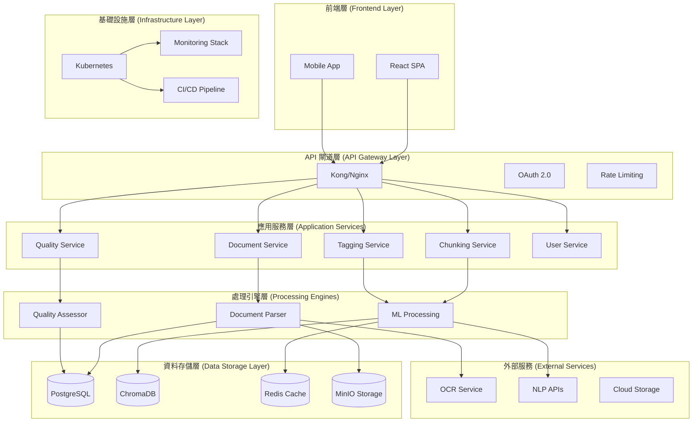
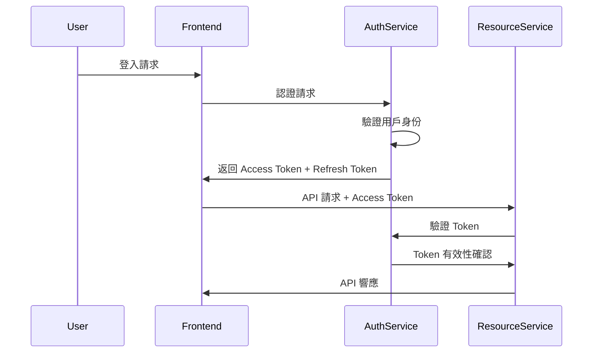

# Document Ingestion 技術架構與 API 規格
## Technical Architecture & API Specifications - Document Ingestion Module

> **系統設計**: 企業級文檔攝取系統的完整技術架構與接口規格

---

## 🏗️ 系統整體架構

### 架構設計原則

1. **微服務架構** - 服務解耦，獨立部署與擴展
2. **事件驅動** - 非同步處理，提升系統吞吐量
3. **雲原生** - 容器化部署，支援水平擴展
4. **安全優先** - 端到端加密，零信任架構
5. **可觀測性** - 完整的監控、日誌、追蹤

### 系統架構圖



---

## 🔧 微服務設計與責任劃分

### 服務邊界與職責

#### 1. Document Service (文檔服務)
**職責**: 文檔生命週期管理與基礎處理

**核心功能**:
- 文檔上傳與存儲
- 文檔解析與內容提取
- 文檔元資料管理
- 文檔版本控制
- 檔案格式驗證

**技術棧**:
- **Framework**: FastAPI + Python 3.11
- **Storage**: MinIO (檔案存儲) + PostgreSQL (元資料)
- **Processing**: Docling + PyPDF2 + python-docx
- **Queue**: Celery + Redis

#### 2. Chunking Service (分塊服務)
**職責**: 智能文檔分塊與分塊管理

**核心功能**:
- 多策略分塊算法
- 分塊品質評估
- 分塊邊界調整
- 分塊版本控制
- 分塊統計分析

**技術棧**:
- **Framework**: FastAPI + Python 3.11
- **ML**: sentence-transformers + spaCy
- **Storage**: PostgreSQL + ChromaDB
- **Cache**: Redis

#### 3. Tagging Service (標籤服務)
**職責**: 智能標籤生成與管理

**核心功能**:
- 自動標籤生成
- 標籤層級管理
- 標籤推薦引擎
- 標籤品質評估
- 協作標註功能

**技術棧**:
- **Framework**: FastAPI + Python 3.11
- **NLP**: spaCy + NLTK + scikit-learn
- **ML**: 自訓練分類模型
- **Storage**: PostgreSQL + Redis

#### 4. Quality Service (品質服務)
**職責**: 多維度品質評估與監控

**核心功能**:
- ISO 25012 品質評估
- 異常檢測與告警
- 品質趨勢分析
- 自動修復建議
- 品質報告生成

**技術棧**:
- **Framework**: FastAPI + Python 3.11
- **ML**: scikit-learn + PyOD
- **Analysis**: pandas + numpy
- **Storage**: PostgreSQL + InfluxDB (時間序列)

#### 5. User Service (用戶服務)
**職責**: 用戶管理與權限控制

**核心功能**:
- 用戶認證與授權
- 角色權限管理
- 操作日誌記錄
- 用戶偏好設定
- 團隊管理

**技術棧**:
- **Framework**: FastAPI + Python 3.11
- **Auth**: OAuth 2.0 + JWT
- **Storage**: PostgreSQL
- **Cache**: Redis

---

## 🌐 RESTful API 詳細規格

### API 設計原則

1. **RESTful 標準**: 遵循 HTTP 語義與 REST 約定
2. **版本控制**: API 版本前綴 `/api/v1/`
3. **統一響應格式**: 標準化的成功與錯誤響應
4. **分頁支援**: 大數據集的分頁與排序
5. **過濾與搜尋**: 靈活的查詢參數支援

### 統一響應格式

#### 成功響應格式
```json
{
  "status": "success",
  "message": "操作成功",
  "data": {
    // 實際資料內容
  },
  "meta": {
    "timestamp": "2024-01-17T10:30:00Z",
    "request_id": "req_12345",
    "pagination": {  // 如有分頁
      "page": 1,
      "limit": 20,
      "total": 100,
      "has_next": true
    }
  }
}
```

#### 錯誤響應格式
```json
{
  "status": "error",
  "error": {
    "code": "INVALID_FILE_FORMAT",
    "message": "不支援的檔案格式",
    "details": "只支援 PDF, DOCX, TXT 格式",
    "field": "file"  // 如果是欄位驗證錯誤
  },
  "meta": {
    "timestamp": "2024-01-17T10:30:00Z",
    "request_id": "req_12345"
  }
}
```

---

## 📤 Document Service API 規格

### 文檔管理 API

#### 1. 文檔上傳
```http
POST /api/v1/documents/upload
Content-Type: multipart/form-data
Authorization: Bearer {token}

# Request Body (Form Data)
file: [binary file data]
metadata: {
  "title": "可選的文檔標題",
  "description": "文檔描述",
  "tags": ["tag1", "tag2"],
  "category": "報告",
  "custom_metadata": {}
}

# Response (201 Created)
{
  "status": "success",
  "message": "文檔上傳成功",
  "data": {
    "document_id": "doc_abc123",
    "filename": "report.pdf",
    "size": 1024000,
    "format": "pdf",
    "upload_url": "https://storage/doc_abc123.pdf",
    "processing_status": "pending",
    "estimated_processing_time": 30
  }
}

# Error Responses
400 - 檔案格式不支援
413 - 檔案過大
422 - 元資料驗證失敗
500 - 服務器內部錯誤
```

#### 2. 批次文檔上傳
```http
POST /api/v1/documents/batch-upload
Content-Type: multipart/form-data
Authorization: Bearer {token}

# Request Body
files[]: [multiple binary files]
batch_metadata: {
  "batch_name": "2024Q1報告",
  "default_category": "財務報告",
  "auto_process": true,
  "notification_email": "user@company.com"
}

# Response (202 Accepted)
{
  "status": "success",
  "message": "批次上傳已開始",
  "data": {
    "batch_id": "batch_xyz789",
    "total_files": 15,
    "estimated_total_time": 450,
    "progress_url": "/api/v1/batches/xyz789/progress",
    "webhook_url": "/api/v1/batches/xyz789/webhook"
  }
}
```

#### 3. 文檔處理狀態查詢
```http
GET /api/v1/documents/{document_id}/status
Authorization: Bearer {token}

# Response (200 OK)
{
  "status": "success",
  "data": {
    "document_id": "doc_abc123",
    "processing_status": "processing",
    "progress_percentage": 45,
    "current_stage": "text_extraction",
    "stages": {
      "upload": { "status": "completed", "time": "2024-01-17T10:30:00Z" },
      "validation": { "status": "completed", "time": "2024-01-17T10:30:05Z" },
      "text_extraction": { "status": "processing", "progress": 45 },
      "chunking": { "status": "pending" },
      "tagging": { "status": "pending" },
      "quality_assessment": { "status": "pending" }
    },
    "estimated_completion": "2024-01-17T10:31:00Z"
  }
}
```

#### 4. 文檔列表查詢
```http
GET /api/v1/documents
Authorization: Bearer {token}

# Query Parameters
?page=1&limit=20&sort=created_date&order=desc&status=completed&category=報告&search=機器學習

# Response (200 OK)
{
  "status": "success",
  "data": [
    {
      "document_id": "doc_abc123",
      "title": "機器學習應用報告",
      "filename": "ml_report.pdf",
      "size": 1024000,
      "format": "pdf",
      "category": "技術報告",
      "tags": ["機器學習", "AI", "技術"],
      "created_date": "2024-01-17T10:30:00Z",
      "modified_date": "2024-01-17T10:35:00Z",
      "processing_status": "completed",
      "quality_score": 0.87,
      "chunk_count": 15,
      "author": "張三",
      "department": "技術部"
    }
  ],
  "meta": {
    "pagination": {
      "page": 1,
      "limit": 20,
      "total": 156,
      "has_next": true,
      "has_prev": false
    },
    "filters_applied": {
      "status": "completed",
      "category": "報告"
    }
  }
}
```

#### 5. 文檔詳細資訊
```http
GET /api/v1/documents/{document_id}
Authorization: Bearer {token}

# Query Parameters
?include=chunks,tags,quality,lineage

# Response (200 OK)
{
  "status": "success",
  "data": {
    "document_id": "doc_abc123",
    "title": "機器學習應用報告",
    "filename": "ml_report.pdf",
    "content_preview": "報告摘要：本報告分析了...",
    "metadata": {
      "authors": ["張三", "李四"],
      "organization": "科技公司",
      "department": "技術部",
      "created_date": "2024-01-17T10:30:00Z",
      "document_type": "技術報告",
      "language": "zh-TW",
      "page_count": 25,
      "word_count": 8500,
      "custom_fields": {}
    },
    "processing_info": {
      "processed_date": "2024-01-17T10:35:00Z",
      "processing_time": 45.2,
      "processor_version": "1.0",
      "processing_config": {
        "chunk_strategy": "semantic",
        "chunk_size": 512,
        "chunk_overlap": 50
      }
    },
    "chunks": [
      {
        "chunk_id": "chunk_001",
        "content": "機器學習是一種人工智慧...",
        "chunk_index": 0,
        "word_count": 156,
        "semantic_type": "text",
        "quality_score": 0.89,
        "start_page": 1,
        "end_page": 1
      }
    ],
    "tags": [
      {
        "tag_id": "tag_ml",
        "name": "機器學習",
        "category": "技術",
        "confidence": 0.95,
        "source": "auto_generated"
      }
    ],
    "quality": {
      "overall_score": 0.87,
      "dimensions": {
        "accuracy": 0.92,
        "completeness": 0.85,
        "consistency": 0.88,
        "currency": 0.75,
        "understandability": 0.90,
        "traceability": 0.82
      },
      "issues": [],
      "recommendations": ["建議更新較舊的參考資料"]
    }
  }
}
```

#### 6. 文檔更新
```http
PUT /api/v1/documents/{document_id}
Content-Type: application/json
Authorization: Bearer {token}

# Request Body
{
  "title": "更新後的標題",
  "metadata": {
    "authors": ["張三", "李四", "王五"],
    "department": "技術部",
    "custom_fields": {
      "project": "AI專案",
      "version": "2.0"
    }
  },
  "tags": ["機器學習", "深度學習", "AI"],
  "processing_config": {
    "rechunk": true,
    "chunk_strategy": "paragraph",
    "chunk_size": 400
  }
}

# Response (200 OK)
{
  "status": "success",
  "message": "文檔更新成功",
  "data": {
    "document_id": "doc_abc123",
    "updated_fields": ["title", "metadata", "tags"],
    "reprocessing_triggered": true,
    "estimated_completion": "2024-01-17T11:00:00Z"
  }
}
```

#### 7. 文檔刪除
```http
DELETE /api/v1/documents/{document_id}
Authorization: Bearer {token}

# Query Parameters
?permanent=false&reason=過期文檔

# Response (200 OK)
{
  "status": "success",
  "message": "文檔已標記刪除",
  "data": {
    "document_id": "doc_abc123",
    "deletion_type": "soft_delete",
    "deleted_at": "2024-01-17T10:45:00Z",
    "restore_before": "2024-02-17T10:45:00Z",
    "restore_url": "/api/v1/documents/doc_abc123/restore"
  }
}
```

---

## 🧩 Chunking Service API 規格

### 分塊處理 API

#### 1. 執行文檔分塊
```http
POST /api/v1/documents/{document_id}/chunk
Content-Type: application/json
Authorization: Bearer {token}

# Request Body
{
  "strategy": "semantic",  // paragraph, sentence, semantic, custom
  "config": {
    "min_chunk_size": 100,
    "max_chunk_size": 800,
    "overlap_percentage": 10,
    "preserve_sentences": true,
    "similarity_threshold": 0.7  // for semantic chunking
  },
  "options": {
    "force_rechunk": false,
    "preserve_existing": false,
    "notify_on_completion": true
  }
}

# Response (202 Accepted)
{
  "status": "success",
  "message": "分塊處理已開始",
  "data": {
    "task_id": "task_chunk_456",
    "document_id": "doc_abc123",
    "strategy": "semantic",
    "estimated_completion": "2024-01-17T10:32:00Z",
    "progress_url": "/api/v1/tasks/task_chunk_456/progress"
  }
}
```

#### 2. 獲取分塊結果
```http
GET /api/v1/documents/{document_id}/chunks
Authorization: Bearer {token}

# Query Parameters
?page=1&limit=50&sort=chunk_index&include_content=true&min_quality=0.7

# Response (200 OK)
{
  "status": "success",
  "data": [
    {
      "chunk_id": "chunk_001",
      "chunk_index": 0,
      "content": "這是第一個分塊的內容...",
      "word_count": 156,
      "sentence_count": 8,
      "semantic_type": "introduction",
      "quality_score": 0.89,
      "start_page": 1,
      "end_page": 1,
      "start_offset": 0,
      "end_offset": 156,
      "created_date": "2024-01-17T10:35:00Z",
      "embedding_status": "completed",
      "tags": ["介紹", "概述"]
    }
  ],
  "meta": {
    "pagination": {
      "page": 1,
      "limit": 50,
      "total": 23,
      "has_next": false
    },
    "summary": {
      "total_chunks": 23,
      "avg_word_count": 267,
      "avg_quality_score": 0.84,
      "chunking_strategy": "semantic"
    }
  }
}
```

#### 3. 更新分塊邊界
```http
PUT /api/v1/chunks/{chunk_id}/boundary
Content-Type: application/json
Authorization: Bearer {token}

# Request Body
{
  "start_offset": 100,
  "end_offset": 500,
  "preserve_semantics": true,
  "auto_adjust": true,
  "reason": "調整語義邊界"
}

# Response (200 OK)
{
  "status": "success",
  "message": "分塊邊界已更新",
  "data": {
    "chunk_id": "chunk_001",
    "old_boundary": { "start": 0, "end": 400 },
    "new_boundary": { "start": 100, "end": 500 },
    "adjusted_boundary": { "start": 98, "end": 502 },
    "adjustment_reason": "調整到句子邊界",
    "affected_chunks": ["chunk_000", "chunk_002"],
    "updated_at": "2024-01-17T10:40:00Z"
  }
}
```

#### 4. 分塊合併
```http
POST /api/v1/chunks/merge
Content-Type: application/json
Authorization: Bearer {token}

# Request Body
{
  "chunk_ids": ["chunk_001", "chunk_002", "chunk_003"],
  "merge_strategy": "sequential",  // sequential, semantic
  "new_chunk_title": "合併後的分塊",
  "preserve_metadata": true
}

# Response (200 OK)
{
  "status": "success",
  "message": "分塊合併成功",
  "data": {
    "new_chunk_id": "chunk_merged_001",
    "merged_chunk_ids": ["chunk_001", "chunk_002", "chunk_003"],
    "content": "合併後的完整內容...",
    "word_count": 567,
    "quality_score": 0.91,
    "merge_metadata": {
      "strategy": "sequential",
      "merged_at": "2024-01-17T10:42:00Z",
      "merged_by": "user_123"
    }
  }
}
```

#### 5. 分塊分割
```http
POST /api/v1/chunks/{chunk_id}/split
Content-Type: application/json
Authorization: Bearer {token}

# Request Body
{
  "split_positions": [200, 400],  // 分割位置 (字符偏移)
  "auto_adjust_positions": true,
  "split_strategy": "sentence_boundary",
  "naming_pattern": "{original_id}_part_{index}"
}

# Response (200 OK)
{
  "status": "success",
  "message": "分塊分割成功",
  "data": {
    "original_chunk_id": "chunk_001",
    "new_chunks": [
      {
        "chunk_id": "chunk_001_part_1",
        "content": "第一部分內容...",
        "word_count": 123
      },
      {
        "chunk_id": "chunk_001_part_2",
        "content": "第二部分內容...",
        "word_count": 156
      },
      {
        "chunk_id": "chunk_001_part_3",
        "content": "第三部分內容...",
        "word_count": 134
      }
    ],
    "split_metadata": {
      "strategy": "sentence_boundary",
      "split_at": "2024-01-17T10:44:00Z"
    }
  }
}
```

---

## 🏷️ Tagging Service API 規格

### 標籤管理 API

#### 1. 自動標籤生成
```http
POST /api/v1/documents/{document_id}/generate-tags
Content-Type: application/json
Authorization: Bearer {token}

# Request Body
{
  "content_source": "full_document",  // full_document, chunks, summary
  "tag_types": ["keywords", "entities", "topics", "categories"],
  "max_tags_per_type": 10,
  "min_confidence": 0.7,
  "custom_rules": [],
  "language": "zh-TW"
}

# Response (200 OK)
{
  "status": "success",
  "message": "標籤生成完成",
  "data": {
    "document_id": "doc_abc123",
    "generated_tags": {
      "keywords": [
        {
          "tag": "機器學習",
          "confidence": 0.95,
          "frequency": 15,
          "positions": [23, 156, 289]
        },
        {
          "tag": "深度學習",
          "confidence": 0.87,
          "frequency": 8,
          "positions": [78, 234]
        }
      ],
      "entities": {
        "PERSON": [
          {"tag": "張三", "confidence": 0.92}
        ],
        "ORG": [
          {"tag": "科技公司", "confidence": 0.89}
        ]
      },
      "topics": [
        {
          "tag": "人工智慧",
          "confidence": 0.91,
          "related_keywords": ["機器學習", "深度學習", "神經網路"]
        }
      ],
      "categories": [
        {
          "tag": "技術報告",
          "confidence": 0.84,
          "reasoning": "包含技術分析和實驗結果"
        }
      ]
    },
    "generation_metadata": {
      "processing_time": 2.3,
      "model_version": "tag_gen_v1.2",
      "total_candidates": 45,
      "selected_tags": 18
    }
  }
}
```

#### 2. 標籤管理 CRUD
```http
# 獲取所有標籤
GET /api/v1/tags
?category=技術&search=機器&sort=usage_count&limit=50

# 建立新標籤
POST /api/v1/tags
{
  "name": "量子計算",
  "category": "技術",
  "description": "量子計算相關內容",
  "color": "#FF6B6B",
  "aliases": ["quantum computing", "量子計算機"],
  "parent_tag_id": "tag_advanced_tech"
}

# 更新標籤
PUT /api/v1/tags/{tag_id}
{
  "name": "機器學習與AI",
  "merge_with": ["tag_ml", "tag_ai"],
  "update_existing_documents": true
}

# 刪除標籤
DELETE /api/v1/tags/{tag_id}
?replace_with=tag_alternative&update_documents=true
```

#### 3. 文檔標籤操作
```http
# 為文檔添加標籤
POST /api/v1/documents/{document_id}/tags
{
  "tag_ids": ["tag_001", "tag_002"],
  "tags": [
    {
      "name": "新標籤",
      "category": "自訂",
      "confidence": 1.0,
      "source": "manual"
    }
  ],
  "replace_existing": false
}

# 移除文檔標籤
DELETE /api/v1/documents/{document_id}/tags
{
  "tag_ids": ["tag_003", "tag_004"],
  "reason": "標籤不相關"
}

# 批次標籤操作
POST /api/v1/documents/batch-tag
{
  "document_ids": ["doc_001", "doc_002", "doc_003"],
  "operation": "add",  // add, remove, replace
  "tag_ids": ["tag_urgent", "tag_review_needed"],
  "apply_to_chunks": true
}
```

---

## 🗄️ 資料庫 Schema 設計

### PostgreSQL 主要資料表

#### 1. Documents 表 (文檔主表)
```sql
CREATE TABLE documents (
    document_id VARCHAR(50) PRIMARY KEY,
    title VARCHAR(500) NOT NULL,
    filename VARCHAR(255) NOT NULL,
    original_filename VARCHAR(255) NOT NULL,

    -- 檔案資訊
    file_size BIGINT NOT NULL,
    file_format VARCHAR(10) NOT NULL,
    file_path VARCHAR(1000) NOT NULL,
    file_hash VARCHAR(64) NOT NULL,  -- SHA-256

    -- 內容統計
    page_count INTEGER DEFAULT 1,
    word_count INTEGER DEFAULT 0,
    paragraph_count INTEGER DEFAULT 0,
    sentence_count INTEGER DEFAULT 0,

    -- 分類資訊
    document_type VARCHAR(50),
    category VARCHAR(100),
    subcategory VARCHAR(100),
    language VARCHAR(10) DEFAULT 'zh-TW',

    -- 作者與來源
    authors JSONB DEFAULT '[]',
    organization VARCHAR(200),
    department VARCHAR(100),
    source_url VARCHAR(1000),

    -- 處理狀態
    processing_status VARCHAR(20) DEFAULT 'pending',
    processed_date TIMESTAMP,
    processing_time REAL,  -- seconds
    processor_version VARCHAR(20),
    processing_config JSONB,

    -- 品質資訊
    quality_score REAL DEFAULT 0.0,
    quality_status VARCHAR(20),
    quality_issues JSONB DEFAULT '[]',

    -- 安全與權限
    security_level VARCHAR(20) DEFAULT 'internal',
    access_permissions JSONB DEFAULT '{}',

    -- 時間戳
    created_date TIMESTAMP NOT NULL DEFAULT NOW(),
    modified_date TIMESTAMP DEFAULT NOW(),
    accessed_date TIMESTAMP,

    -- 版本控制
    version VARCHAR(20) DEFAULT '1.0',
    parent_document_id VARCHAR(50) REFERENCES documents(document_id),

    -- 使用統計
    access_count INTEGER DEFAULT 0,
    download_count INTEGER DEFAULT 0,

    -- 自訂欄位
    custom_metadata JSONB DEFAULT '{}',

    -- 軟刪除
    is_deleted BOOLEAN DEFAULT FALSE,
    deleted_date TIMESTAMP,
    deleted_by VARCHAR(50)
);

-- 索引設計
CREATE INDEX idx_documents_status ON documents(processing_status);
CREATE INDEX idx_documents_type ON documents(document_type);
CREATE INDEX idx_documents_category ON documents(category);
CREATE INDEX idx_documents_created ON documents(created_date);
CREATE INDEX idx_documents_quality ON documents(quality_score);
CREATE INDEX idx_documents_search ON documents USING gin(to_tsvector('english', title || ' ' || COALESCE(custom_metadata->>'description', '')));
```

#### 2. Document_Chunks 表 (分塊表)
```sql
CREATE TABLE document_chunks (
    chunk_id VARCHAR(50) PRIMARY KEY,
    document_id VARCHAR(50) NOT NULL REFERENCES documents(document_id) ON DELETE CASCADE,

    -- 內容資訊
    content TEXT NOT NULL,
    content_hash VARCHAR(64) NOT NULL,  -- SHA-256

    -- 位置資訊
    chunk_index INTEGER NOT NULL,
    start_page INTEGER,
    end_page INTEGER,
    start_offset INTEGER,
    end_offset INTEGER,

    -- 統計資訊
    word_count INTEGER NOT NULL,
    sentence_count INTEGER,
    character_count INTEGER,

    -- 分塊類型與品質
    semantic_type VARCHAR(50) DEFAULT 'text',  -- text, table, figure, header, footer
    chunk_quality REAL DEFAULT 0.0,
    semantic_coherence REAL,  -- 語義一致性分數

    -- 向量嵌入資訊
    embedding_model VARCHAR(100),
    embedding_dim INTEGER,
    embedding_status VARCHAR(20) DEFAULT 'pending',

    -- 分塊策略資訊
    chunking_strategy VARCHAR(50),
    chunking_config JSONB,

    -- 編輯歷史
    edit_count INTEGER DEFAULT 0,
    last_edited_date TIMESTAMP,
    last_edited_by VARCHAR(50),
    edit_summary TEXT,

    -- 時間戳
    created_date TIMESTAMP NOT NULL DEFAULT NOW(),

    -- 版本控制
    version INTEGER DEFAULT 1,
    original_chunk_id VARCHAR(50),  -- 指向原始分塊

    UNIQUE(document_id, chunk_index)
);

-- 索引設計
CREATE INDEX idx_chunks_document ON document_chunks(document_id);
CREATE INDEX idx_chunks_quality ON document_chunks(chunk_quality);
CREATE INDEX idx_chunks_type ON document_chunks(semantic_type);
CREATE INDEX idx_chunks_embedding ON document_chunks(embedding_status);
CREATE INDEX idx_chunks_search ON document_chunks USING gin(to_tsvector('english', content));
```

#### 3. Tags 表 (標籤表)
```sql
CREATE TABLE tags (
    tag_id VARCHAR(50) PRIMARY KEY,
    name VARCHAR(200) NOT NULL,
    normalized_name VARCHAR(200) NOT NULL,  -- 正規化後的名稱

    -- 分類資訊
    category VARCHAR(100),
    subcategory VARCHAR(100),
    tag_type VARCHAR(50) DEFAULT 'keyword',  -- keyword, entity, topic, category

    -- 層級結構
    parent_tag_id VARCHAR(50) REFERENCES tags(tag_id),
    hierarchy_level INTEGER DEFAULT 0,
    hierarchy_path VARCHAR(1000),  -- 完整路徑

    -- 標籤屬性
    description TEXT,
    color VARCHAR(7),  -- Hex color code
    icon VARCHAR(50),
    aliases JSONB DEFAULT '[]',  -- 同義詞列表

    -- 使用統計
    usage_count INTEGER DEFAULT 0,
    document_count INTEGER DEFAULT 0,
    chunk_count INTEGER DEFAULT 0,

    -- 品質資訊
    confidence_score REAL DEFAULT 1.0,
    quality_score REAL DEFAULT 1.0,

    -- 生成資訊
    source VARCHAR(50) DEFAULT 'manual',  -- manual, auto_generated, imported
    generator_model VARCHAR(100),
    generation_config JSONB,

    -- 管理資訊
    created_by VARCHAR(50),
    approved_by VARCHAR(50),
    approval_status VARCHAR(20) DEFAULT 'approved',

    -- 時間戳
    created_date TIMESTAMP NOT NULL DEFAULT NOW(),
    modified_date TIMESTAMP DEFAULT NOW(),
    last_used_date TIMESTAMP,

    -- 軟刪除
    is_active BOOLEAN DEFAULT TRUE,

    UNIQUE(normalized_name, category)
);

-- 索引設計
CREATE INDEX idx_tags_category ON tags(category);
CREATE INDEX idx_tags_parent ON tags(parent_tag_id);
CREATE INDEX idx_tags_usage ON tags(usage_count DESC);
CREATE INDEX idx_tags_search ON tags USING gin(to_tsvector('english', name || ' ' || COALESCE(description, '')));
CREATE INDEX idx_tags_hierarchy ON tags(hierarchy_level, hierarchy_path);
```

#### 4. Document_Tags 關聯表 (文檔標籤關係)
```sql
CREATE TABLE document_tags (
    document_id VARCHAR(50) REFERENCES documents(document_id) ON DELETE CASCADE,
    tag_id VARCHAR(50) REFERENCES tags(tag_id) ON DELETE CASCADE,

    -- 標籤來源與信心度
    confidence REAL DEFAULT 1.0,
    source VARCHAR(50) DEFAULT 'manual',  -- manual, auto_generated, suggested

    -- 應用層級
    applied_to VARCHAR(20) DEFAULT 'document',  -- document, chunk
    chunk_id VARCHAR(50) REFERENCES document_chunks(chunk_id),

    -- 標註資訊
    tagged_by VARCHAR(50),
    tagged_date TIMESTAMP NOT NULL DEFAULT NOW(),

    -- 驗證資訊
    verified BOOLEAN DEFAULT FALSE,
    verified_by VARCHAR(50),
    verified_date TIMESTAMP,

    -- 標籤位置 (for chunk-level tags)
    start_position INTEGER,
    end_position INTEGER,
    context TEXT,  -- 標籤周圍的上下文

    PRIMARY KEY (document_id, tag_id, COALESCE(chunk_id, 'document'))
);

-- 索引設計
CREATE INDEX idx_document_tags_doc ON document_tags(document_id);
CREATE INDEX idx_document_tags_tag ON document_tags(tag_id);
CREATE INDEX idx_document_tags_source ON document_tags(source);
CREATE INDEX idx_document_tags_confidence ON document_tags(confidence DESC);
```

#### 5. Processing_Tasks 表 (處理任務)
```sql
CREATE TABLE processing_tasks (
    task_id VARCHAR(50) PRIMARY KEY,
    document_id VARCHAR(50) REFERENCES documents(document_id),

    -- 任務資訊
    task_type VARCHAR(50) NOT NULL,  -- parse, chunk, tag, quality_assess
    task_status VARCHAR(20) DEFAULT 'pending',
    priority INTEGER DEFAULT 0,

    -- 配置與參數
    task_config JSONB,
    input_data JSONB,

    -- 執行資訊
    worker_id VARCHAR(50),
    started_date TIMESTAMP,
    completed_date TIMESTAMP,
    processing_time REAL,

    -- 結果資訊
    output_data JSONB,
    success BOOLEAN,
    error_message TEXT,
    retry_count INTEGER DEFAULT 0,
    max_retries INTEGER DEFAULT 3,

    -- 進度追蹤
    progress_percentage INTEGER DEFAULT 0,
    current_step VARCHAR(100),
    total_steps INTEGER,

    -- 依賴關係
    depends_on JSONB DEFAULT '[]',  -- 依賴的其他任務

    -- 時間戳
    created_date TIMESTAMP NOT NULL DEFAULT NOW(),
    modified_date TIMESTAMP DEFAULT NOW()
);

-- 索引設計
CREATE INDEX idx_tasks_document ON processing_tasks(document_id);
CREATE INDEX idx_tasks_status ON processing_tasks(task_status);
CREATE INDEX idx_tasks_type ON processing_tasks(task_type);
CREATE INDEX idx_tasks_priority ON processing_tasks(priority DESC, created_date);
CREATE INDEX idx_tasks_worker ON processing_tasks(worker_id);
```

---

## ⚡ 事件驅動架構設計

### 事件總線配置

#### 事件定義規範
```yaml
Event Schema:
  event_id: string (UUID)
  event_type: string (enum)
  source_service: string
  timestamp: datetime (ISO 8601)
  version: string
  correlation_id: string
  causation_id: string
  data: object
  metadata:
    user_id: string
    session_id: string
    ip_address: string
    user_agent: string
```

#### 核心事件類型

##### 文檔生命週期事件
```yaml
# 文檔上傳事件
DocumentUploadStarted:
  event_type: "document.upload.started"
  data:
    document_id: string
    filename: string
    file_size: integer
    user_id: string
    upload_session_id: string

DocumentUploadCompleted:
  event_type: "document.upload.completed"
  data:
    document_id: string
    file_path: string
    metadata: object
    upload_duration: number

DocumentUploadFailed:
  event_type: "document.upload.failed"
  data:
    document_id: string
    error_code: string
    error_message: string
    retry_count: integer

# 文檔處理事件
DocumentProcessingStarted:
  event_type: "document.processing.started"
  data:
    document_id: string
    processing_config: object
    estimated_duration: number

DocumentProcessingCompleted:
  event_type: "document.processing.completed"
  data:
    document_id: string
    processing_result: object
    processing_duration: number
    quality_score: number
```

##### 分塊處理事件
```yaml
ChunkingStarted:
  event_type: "chunking.started"
  data:
    document_id: string
    chunking_strategy: string
    chunking_config: object

ChunkingCompleted:
  event_type: "chunking.completed"
  data:
    document_id: string
    chunk_ids: array
    chunking_stats: object
    quality_metrics: object

ChunkUpdated:
  event_type: "chunk.updated"
  data:
    chunk_id: string
    document_id: string
    change_type: string  # content, boundary, metadata
    old_value: object
    new_value: object
    updated_by: string
```

##### 標籤處理事件
```yaml
TaggingStarted:
  event_type: "tagging.started"
  data:
    document_id: string
    tagging_config: object
    tag_types: array

TagsGenerated:
  event_type: "tags.generated"
  data:
    document_id: string
    generated_tags: array
    confidence_scores: object
    generation_model: string

TagAdded:
  event_type: "tag.added"
  data:
    document_id: string
    tag_id: string
    chunk_id: string  # optional
    source: string
    confidence: number
    added_by: string
```

### 事件處理器設計

#### 事件處理器列表

##### Document Service 事件處理器
```python
@event_handler("document.upload.completed")
async def trigger_document_processing(event: Event):
    """文檔上傳完成後觸發處理流程"""
    document_id = event.data["document_id"]

    # 1. 驗證檔案完整性
    await validate_document_integrity(document_id)

    # 2. 發起內容解析任務
    await publish_event("document.processing.started", {
        "document_id": document_id,
        "processing_config": get_default_config()
    })

@event_handler("document.processing.completed")
async def trigger_downstream_processing(event: Event):
    """文檔處理完成後觸發下游處理"""
    document_id = event.data["document_id"]

    # 1. 觸發分塊處理
    await publish_event("chunking.started", {
        "document_id": document_id
    })

    # 2. 觸發品質評估
    await publish_event("quality.assessment.started", {
        "document_id": document_id
    })
```

##### Chunking Service 事件處理器
```python
@event_handler("chunking.started")
async def process_document_chunking(event: Event):
    """處理文檔分塊"""
    document_id = event.data["document_id"]
    config = event.data.get("chunking_config", {})

    # 1. 獲取文檔內容
    content = await get_document_content(document_id)

    # 2. 執行分塊處理
    chunks = await perform_chunking(content, config)

    # 3. 存儲分塊結果
    await save_chunks(document_id, chunks)

    # 4. 發布完成事件
    await publish_event("chunking.completed", {
        "document_id": document_id,
        "chunk_ids": [c.chunk_id for c in chunks]
    })

@event_handler("chunking.completed")
async def trigger_embedding_generation(event: Event):
    """分塊完成後觸發向量嵌入生成"""
    await publish_event("embedding.generation.started", {
        "document_id": event.data["document_id"],
        "chunk_ids": event.data["chunk_ids"]
    })
```

##### Tagging Service 事件處理器
```python
@event_handler("chunking.completed")
async def generate_automatic_tags(event: Event):
    """分塊完成後自動生成標籤"""
    document_id = event.data["document_id"]

    # 1. 獲取文檔內容與分塊
    doc_data = await get_document_with_chunks(document_id)

    # 2. 生成標籤
    tags = await generate_tags(doc_data)

    # 3. 存儲標籤
    await save_document_tags(document_id, tags)

    # 4. 發布事件
    await publish_event("tags.generated", {
        "document_id": document_id,
        "generated_tags": tags
    })
```

---

## 🔐 安全架構設計

### 認證與授權

#### OAuth 2.0 流程


#### 權限控制模型 (RBAC)
```yaml
Roles:
  - admin:
      permissions:
        - documents.create
        - documents.read
        - documents.update
        - documents.delete
        - chunks.edit
        - tags.manage
        - quality.configure

  - editor:
      permissions:
        - documents.create
        - documents.read
        - documents.update
        - chunks.edit
        - tags.add
        - tags.remove

  - viewer:
      permissions:
        - documents.read
        - chunks.read
        - tags.read

  - analyst:
      permissions:
        - documents.read
        - documents.export
        - chunks.read
        - chunks.export
        - quality.view
```

### 資料安全

#### 敏感資訊檢測
```python
class SensitiveInfoDetector:
    """敏感資訊自動檢測器"""

    PATTERNS = {
        'email': r'\b[A-Za-z0-9._%+-]+@[A-Za-z0-9.-]+\.[A-Z|a-z]{2,}\b',
        'phone': r'(\+886|0)\d{2,3}-?\d{3,4}-?\d{4}',
        'id_number': r'\b[A-Z][12]\d{8}\b',  # 台灣身分證
        'credit_card': r'\b\d{4}[\s-]?\d{4}[\s-]?\d{4}[\s-]?\d{4}\b'
    }

    async def scan_content(self, content: str) -> List[Dict]:
        """掃描內容中的敏感資訊"""
        findings = []

        for info_type, pattern in self.PATTERNS.items():
            matches = re.finditer(pattern, content)
            for match in matches:
                findings.append({
                    'type': info_type,
                    'value': match.group(),
                    'position': match.span(),
                    'confidence': 0.9,
                    'action_required': True
                })

        return findings
```

#### 資料加密策略
```yaml
Encryption Layers:
  # 傳輸加密
  transport:
    protocol: TLS 1.3
    cipher_suites:
      - TLS_AES_256_GCM_SHA384
      - TLS_CHACHA20_POLY1305_SHA256

  # 應用層加密
  application:
    algorithm: AES-256-GCM
    key_rotation: 90 days
    key_management: HashiCorp Vault

  # 資料庫加密
  database:
    transparent_encryption: enabled
    column_encryption:
      - documents.custom_metadata
      - document_chunks.content (if sensitive)
      - processing_tasks.input_data

  # 檔案存儲加密
  storage:
    server_side_encryption: AES-256
    client_side_encryption: true
    key_per_document: true
```

---

## 📊 性能設計與優化

### 性能需求指標

#### 響應時間需求
| 操作 | P50 | P95 | P99 | 最大值 |
|------|-----|-----|-----|-------|
| 文檔上傳 | 100ms | 300ms | 500ms | 1s |
| 文檔列表查詢 | 50ms | 150ms | 300ms | 500ms |
| 分塊處理 | 2s | 8s | 15s | 30s |
| 標籤生成 | 500ms | 2s | 5s | 10s |
| 搜尋查詢 | 100ms | 500ms | 1s | 2s |

#### 吞吐量需求
| 操作 | 目標 TPS | 峰值 TPS | 並發數 |
|------|-----------|-----------|---------|
| API 請求 | 500 | 1000 | 100 |
| 文檔上傳 | 50 | 100 | 20 |
| 文檔處理 | 10 | 25 | 5 |

### 性能優化策略

#### 1. 快取策略
```python
# Redis 快取層級
CACHE_STRATEGIES = {
    # 文檔元資料快取
    'document_metadata': {
        'ttl': 3600,  # 1小時
        'key_pattern': 'doc:meta:{document_id}',
        'invalidation': ['document.updated', 'document.deleted']
    },

    # 分塊結果快取
    'chunk_results': {
        'ttl': 7200,  # 2小時
        'key_pattern': 'doc:chunks:{document_id}',
        'invalidation': ['chunking.completed', 'chunk.updated']
    },

    # 標籤建議快取
    'tag_suggestions': {
        'ttl': 1800,  # 30分鐘
        'key_pattern': 'tags:suggest:{content_hash}',
        'max_size': '100MB'
    },

    # 搜尋結果快取
    'search_results': {
        'ttl': 300,   # 5分鐘
        'key_pattern': 'search:{query_hash}',
        'max_entries': 10000
    }
}
```

#### 2. 資料庫優化
```sql
-- 分區策略 (按時間分區)
CREATE TABLE documents (
    -- ... existing columns ...
) PARTITION BY RANGE (created_date);

CREATE TABLE documents_2024_q1 PARTITION OF documents
FOR VALUES FROM ('2024-01-01') TO ('2024-04-01');

CREATE TABLE documents_2024_q2 PARTITION OF documents
FOR VALUES FROM ('2024-04-01') TO ('2024-07-01');

-- 索引優化
CREATE INDEX CONCURRENTLY idx_documents_composite
ON documents(processing_status, quality_score, created_date DESC)
WHERE is_deleted = FALSE;

-- 統計資訊更新
ANALYZE documents;
ANALYZE document_chunks;
ANALYZE tags;
```

#### 3. 非同步處理架構
```python
# Celery 任務配置
CELERY_CONFIG = {
    'broker_url': 'redis://redis:6379/0',
    'result_backend': 'redis://redis:6379/0',

    'task_routes': {
        'document.parse': {'queue': 'document_processing'},
        'document.chunk': {'queue': 'ml_processing'},
        'document.tag': {'queue': 'ml_processing'},
        'document.quality': {'queue': 'quality_assessment'},
        'notification.*': {'queue': 'notifications'}
    },

    'worker_prefetch_multiplier': 1,
    'task_acks_late': True,
    'worker_max_tasks_per_child': 100
}

# 優先隊列設計
PRIORITY_QUEUES = {
    'critical': {
        'priority': 10,
        'routing_key': 'critical.#',
        'max_workers': 5
    },
    'high': {
        'priority': 7,
        'routing_key': 'high.#',
        'max_workers': 10
    },
    'normal': {
        'priority': 5,
        'routing_key': 'normal.#',
        'max_workers': 15
    },
    'low': {
        'priority': 2,
        'routing_key': 'low.#',
        'max_workers': 5
    }
}
```

---

## 🔌 外部系統整合規格

### 檔案存儲系統 (MinIO/S3)

#### 存儲策略設計
```yaml
Bucket Structure:
  # 原始文檔存儲
  raw-documents:
    path_pattern: "/{year}/{month}/{document_id}/{filename}"
    retention: 7 years
    versioning: enabled
    encryption: AES-256
    access_policy: private

  # 處理結果存儲
  processed-documents:
    path_pattern: "/{document_id}/processed/{version}/{filename}"
    retention: 3 years
    compression: gzip

  # 縮略圖與預覽
  thumbnails:
    path_pattern: "/{document_id}/thumbnails/{size}/{format}"
    retention: 1 year
    cdn_enabled: true

  # 備份存儲
  backups:
    path_pattern: "/backups/{date}/{document_id}.tar.gz"
    retention: 10 years
    cold_storage: true
```

#### 檔案操作 API
```python
class DocumentStorageService:
    """文檔存儲服務"""

    async def upload_document(self,
                            file_data: bytes,
                            document_id: str,
                            metadata: Dict) -> str:
        """上傳文檔到存儲"""

    async def get_document_url(self,
                             document_id: str,
                             expires_in: int = 3600) -> str:
        """獲取文檔訪問 URL (預簽名)"""

    async def delete_document(self,
                            document_id: str,
                            permanent: bool = False) -> bool:
        """刪除文檔 (軟刪除或永久刪除)"""

    async def backup_document(self,
                            document_id: str,
                            backup_type: str) -> str:
        """備份文檔"""
```

### 向量資料庫整合 (ChromaDB)

#### 向量存儲策略
```python
# ChromaDB 集合配置
VECTOR_COLLECTIONS = {
    'document_chunks': {
        'embedding_model': 'all-MiniLM-L6-v2',
        'dimension': 384,
        'distance_metric': 'cosine',
        'metadata_schema': {
            'document_id': 'string',
            'chunk_index': 'integer',
            'semantic_type': 'string',
            'quality_score': 'float',
            'created_date': 'datetime'
        },
        'index_config': {
            'hnsw_space': 'cosine',
            'hnsw_construction_ef': 200,
            'hnsw_m': 16
        }
    },

    'document_embeddings': {
        'embedding_model': 'text-embedding-ada-002',
        'dimension': 1536,
        'distance_metric': 'cosine',
        'use_case': 'document_similarity'
    }
}

class VectorIndexService:
    """向量索引服務"""

    async def add_chunk_embeddings(self,
                                 chunks: List[DocumentChunk]) -> List[str]:
        """添加分塊向量嵌入"""

    async def semantic_search(self,
                            query: str,
                            filters: Dict,
                            top_k: int = 10) -> List[SearchResult]:
        """語義搜尋"""

    async def find_similar_chunks(self,
                                chunk_id: str,
                                top_k: int = 5) -> List[SimilarChunk]:
        """找到相似分塊"""
```

---

## 📈 監控與可觀測性

### 指標收集策略

#### 應用指標 (Application Metrics)
```python
# Prometheus 指標定義
from prometheus_client import Counter, Histogram, Gauge

# 文檔處理指標
documents_processed = Counter(
    'documents_processed_total',
    '已處理文檔總數',
    ['status', 'document_type', 'size_category']
)

document_processing_duration = Histogram(
    'document_processing_duration_seconds',
    '文檔處理耗時',
    ['processing_stage', 'document_type'],
    buckets=[0.1, 0.5, 1.0, 2.0, 5.0, 10.0, 30.0, 60.0]
)

# 品質指標
quality_score_distribution = Histogram(
    'quality_score_distribution',
    '品質分數分佈',
    ['document_type'],
    buckets=[0.1, 0.3, 0.5, 0.7, 0.8, 0.9, 0.95, 1.0]
)

# 系統健康指標
active_connections = Gauge(
    'active_connections',
    '活躍連線數'
)

processing_queue_size = Gauge(
    'processing_queue_size',
    '處理隊列大小',
    ['queue_name']
)
```

#### 業務指標 (Business Metrics)
```python
# 用戶行為指標
user_actions = Counter(
    'user_actions_total',
    '用戶操作總數',
    ['action_type', 'user_role']
)

document_lifecycle = Histogram(
    'document_lifecycle_duration',
    '文檔生命週期耗時',
    ['lifecycle_stage']
)

# 功能使用指標
feature_usage = Counter(
    'feature_usage_total',
    '功能使用次數',
    ['feature_name', 'user_segment']
)
```

### 日誌設計

#### 結構化日誌格式
```json
{
  "timestamp": "2024-01-17T10:30:00.123Z",
  "level": "INFO",
  "service": "document-service",
  "logger": "document.processor",
  "message": "Document processing completed",
  "context": {
    "document_id": "doc_abc123",
    "user_id": "user_456",
    "processing_time": 5.67,
    "chunk_count": 15,
    "quality_score": 0.87
  },
  "trace_id": "trace_xyz789",
  "span_id": "span_123",
  "request_id": "req_456",
  "version": "1.0",
  "environment": "production"
}
```

#### 日誌等級與內容
```python
# 日誌記錄策略
LOGGING_CONFIG = {
    'ERROR': [
        'system_errors',
        'processing_failures',
        'security_incidents',
        'data_corruption'
    ],

    'WARN': [
        'quality_threshold_breach',
        'unusual_processing_time',
        'deprecated_api_usage',
        'resource_limit_approaching'
    ],

    'INFO': [
        'document_lifecycle_events',
        'user_actions',
        'system_state_changes',
        'performance_milestones'
    ],

    'DEBUG': [
        'detailed_processing_steps',
        'algorithm_decisions',
        'cache_hits_misses',
        'internal_service_calls'
    ]
}
```

### 分散式追蹤

#### OpenTelemetry 整合
```python
from opentelemetry import trace
from opentelemetry.exporter.jaeger.thrift import JaegerExporter
from opentelemetry.sdk.trace import TracerProvider

# 追蹤配置
tracer = trace.get_tracer("document-ingestion-service")

@tracer.start_as_current_span("process_document")
async def process_document(document_id: str) -> ProcessingResult:
    """文檔處理主流程 - 分散式追蹤"""

    with tracer.start_as_current_span("extract_text") as span:
        span.set_attributes({
            "document.id": document_id,
            "document.type": "pdf",
            "processing.stage": "text_extraction"
        })

        text_content = await extract_text_content(document_id)
        span.set_attribute("text.length", len(text_content))

    with tracer.start_as_current_span("chunk_text") as span:
        chunks = await chunk_text_content(text_content)
        span.set_attribute("chunks.count", len(chunks))

    return ProcessingResult(chunks=chunks)
```

---

## 🚢 部署與運維架構

### Kubernetes 部署配置

#### 服務部署清單
```yaml
# Document Service 部署
apiVersion: apps/v1
kind: Deployment
metadata:
  name: document-service
  labels:
    app: document-service
    tier: backend
spec:
  replicas: 3
  selector:
    matchLabels:
      app: document-service
  template:
    metadata:
      labels:
        app: document-service
    spec:
      containers:
      - name: document-service
        image: kms/document-service:v1.0
        ports:
        - containerPort: 8000
        env:
        - name: DATABASE_URL
          valueFrom:
            secretKeyRef:
              name: db-credentials
              key: postgres_url
        - name: REDIS_URL
          value: "redis://redis-service:6379"
        resources:
          requests:
            memory: "512Mi"
            cpu: "250m"
          limits:
            memory: "1Gi"
            cpu: "500m"
        livenessProbe:
          httpGet:
            path: /health
            port: 8000
          initialDelaySeconds: 30
          periodSeconds: 10
        readinessProbe:
          httpGet:
            path: /ready
            port: 8000
          initialDelaySeconds: 5
          periodSeconds: 5

---
# Horizontal Pod Autoscaler
apiVersion: autoscaling/v2
kind: HorizontalPodAutoscaler
metadata:
  name: document-service-hpa
spec:
  scaleTargetRef:
    apiVersion: apps/v1
    kind: Deployment
    name: document-service
  minReplicas: 2
  maxReplicas: 10
  metrics:
  - type: Resource
    resource:
      name: cpu
      target:
        type: Utilization
        averageUtilization: 70
  - type: Resource
    resource:
      name: memory
      target:
        type: Utilization
        averageUtilization: 80
```

#### Ingress 配置
```yaml
apiVersion: networking.k8s.io/v1
kind: Ingress
metadata:
  name: kms-ingress
  annotations:
    nginx.ingress.kubernetes.io/rewrite-target: /
    nginx.ingress.kubernetes.io/ssl-redirect: "true"
    nginx.ingress.kubernetes.io/client-max-body-size: "50m"
    nginx.ingress.kubernetes.io/rate-limit: "100"
    cert-manager.io/cluster-issuer: "letsencrypt-prod"
spec:
  tls:
  - hosts:
    - api.kms.company.com
    secretName: kms-tls
  rules:
  - host: api.kms.company.com
    http:
      paths:
      - path: /api/v1/documents
        pathType: Prefix
        backend:
          service:
            name: document-service
            port:
              number: 8000
      - path: /api/v1/chunks
        pathType: Prefix
        backend:
          service:
            name: chunking-service
            port:
              number: 8001
```

### CI/CD Pipeline 設計

#### GitOps 工作流程
```yaml
# .github/workflows/deploy.yml
name: Deploy KMS Services

on:
  push:
    branches: [main]
  pull_request:
    branches: [main]

jobs:
  test:
    runs-on: ubuntu-latest
    steps:
    - uses: actions/checkout@v3

    - name: Set up Python
      uses: actions/setup-python@v4
      with:
        python-version: '3.11'

    - name: Install dependencies
      run: |
        pip install -r requirements.txt
        pip install -r requirements-dev.txt

    - name: Run tests
      run: |
        pytest tests/ --cov=src --cov-report=xml

    - name: Code quality checks
      run: |
        black --check src/
        isort --check-only src/
        flake8 src/
        mypy src/

  security:
    runs-on: ubuntu-latest
    steps:
    - uses: actions/checkout@v3

    - name: Run security scan
      run: |
        bandit -r src/
        safety check

  build:
    needs: [test, security]
    runs-on: ubuntu-latest
    steps:
    - uses: actions/checkout@v3

    - name: Build Docker images
      run: |
        docker build -t kms/document-service:${{ github.sha }} .

    - name: Push to registry
      run: |
        echo ${{ secrets.REGISTRY_PASSWORD }} | docker login -u ${{ secrets.REGISTRY_USERNAME }} --password-stdin
        docker push kms/document-service:${{ github.sha }}

  deploy:
    needs: build
    runs-on: ubuntu-latest
    if: github.ref == 'refs/heads/main'
    steps:
    - name: Deploy to Kubernetes
      run: |
        kubectl set image deployment/document-service document-service=kms/document-service:${{ github.sha }}
        kubectl rollout status deployment/document-service
```

---

## 🛡️ 安全架構深度設計

### API 安全策略

#### 1. 認證與授權中間件
```python
from fastapi import HTTPException, Depends
from fastapi.security import HTTPBearer, HTTPAuthorizationCredentials

security = HTTPBearer()

async def verify_token(credentials: HTTPAuthorizationCredentials = Depends(security)):
    """JWT Token 驗證中間件"""
    token = credentials.credentials

    try:
        payload = jwt.decode(token, SECRET_KEY, algorithms=["HS256"])
        user_id = payload.get("sub")

        if not user_id:
            raise HTTPException(status_code=401, detail="Invalid token")

        # 檢查 token 是否在黑名單
        if await is_token_blacklisted(token):
            raise HTTPException(status_code=401, detail="Token revoked")

        return {
            "user_id": user_id,
            "roles": payload.get("roles", []),
            "permissions": payload.get("permissions", [])
        }

    except jwt.ExpiredSignatureError:
        raise HTTPException(status_code=401, detail="Token expired")
    except jwt.JWTError:
        raise HTTPException(status_code=401, detail="Invalid token")

async def require_permission(permission: str):
    """權限檢查裝飾器"""
    def permission_checker(user = Depends(verify_token)):
        if permission not in user["permissions"]:
            raise HTTPException(
                status_code=403,
                detail=f"Missing required permission: {permission}"
            )
        return user
    return permission_checker
```

#### 2. API 速率限制
```python
from slowapi import Limiter, _rate_limit_exceeded_handler
from slowapi.util import get_remote_address

limiter = Limiter(key_func=get_remote_address)

# 不同端點的速率限制
RATE_LIMITS = {
    "/api/v1/documents/upload": "10/minute",
    "/api/v1/documents/batch-upload": "2/hour",
    "/api/v1/search": "100/minute",
    "/api/v1/documents": "200/minute"
}

@app.post("/api/v1/documents/upload")
@limiter.limit("10/minute")
async def upload_document(request: Request, ...):
    """文檔上傳 - 限制 10次/分鐘"""
    pass
```

#### 3. 輸入驗證與清理
```python
from pydantic import BaseModel, validator, Field
import bleach

class DocumentUploadRequest(BaseModel):
    """文檔上傳請求驗證"""

    title: str = Field(..., min_length=1, max_length=500)
    description: Optional[str] = Field(None, max_length=2000)
    category: str = Field(..., regex="^[a-zA-Z0-9_\\u4e00-\\u9fff\\s-]+$")
    tags: List[str] = Field(default_factory=list, max_items=20)

    @validator('title')
    def sanitize_title(cls, v):
        return bleach.clean(v, tags=[], strip=True)

    @validator('description')
    def sanitize_description(cls, v):
        if v:
            return bleach.clean(v, tags=[], strip=True)
        return v

    @validator('tags')
    def validate_tags(cls, v):
        sanitized_tags = []
        for tag in v:
            clean_tag = bleach.clean(tag, tags=[], strip=True)
            if 1 <= len(clean_tag) <= 50:
                sanitized_tags.append(clean_tag)
        return sanitized_tags[:20]  # 限制標籤數量
```

### 資料保護策略

#### 1. 敏感資料處理
```python
class SensitiveDataHandler:
    """敏感資料處理器"""

    PII_PATTERNS = {
        'taiwan_id': r'\b[A-Z][12]\d{8}\b',
        'email': r'\b[A-Za-z0-9._%+-]+@[A-Za-z0-9.-]+\.[A-Z|a-z]{2,}\b',
        'phone': r'(\+886|0)\d{2,3}-?\d{3,4}-?\d{4}',
        'credit_card': r'\b\d{4}[\s-]?\d{4}[\s-]?\d{4}[\s-]?\d{4}\b'
    }

    async def scan_and_mask_sensitive_data(self, content: str) -> Tuple[str, List[Dict]]:
        """掃描並遮罩敏感資料"""
        masked_content = content
        findings = []

        for data_type, pattern in self.PII_PATTERNS.items():
            for match in re.finditer(pattern, content):
                # 記錄發現的敏感資料
                findings.append({
                    'type': data_type,
                    'position': match.span(),
                    'confidence': 0.9,
                    'action': 'masked'
                })

                # 遮罩敏感資料
                sensitive_value = match.group()
                masked_value = self._mask_value(sensitive_value, data_type)
                masked_content = masked_content.replace(sensitive_value, masked_value)

        return masked_content, findings

    def _mask_value(self, value: str, data_type: str) -> str:
        """遮罩敏感值"""
        if data_type == 'taiwan_id':
            return value[:2] + '*' * 6 + value[-2:]
        elif data_type == 'email':
            user, domain = value.split('@')
            return user[:2] + '*' * (len(user)-2) + '@' + domain
        elif data_type == 'phone':
            return value[:4] + '*' * (len(value)-6) + value[-2:]
        elif data_type == 'credit_card':
            return '*' * 12 + value[-4:]

        return '*' * len(value)
```

#### 2. 審計日誌
```python
class AuditLogger:
    """審計日誌記錄器"""

    async def log_user_action(self,
                            user_id: str,
                            action: str,
                            resource: str,
                            details: Dict):
        """記錄用戶操作"""
        audit_record = {
            'timestamp': datetime.utcnow(),
            'user_id': user_id,
            'action': action,
            'resource': resource,
            'resource_id': details.get('resource_id'),
            'ip_address': details.get('ip_address'),
            'user_agent': details.get('user_agent'),
            'request_id': details.get('request_id'),
            'result': details.get('result', 'success'),
            'error_message': details.get('error_message'),
            'additional_context': details.get('context', {})
        }

        # 寫入審計資料庫
        await self.audit_db.insert_audit_record(audit_record)

        # 敏感操作即時告警
        if action in ['delete', 'export', 'admin_access']:
            await self.send_security_alert(audit_record)
```

---

## 📊 性能基準與容量規劃

### 系統容量設計

#### 資料容量預估
```yaml
Data Growth Projections:
  # 第一年
  year_1:
    documents: 100,000
    avg_document_size: 2MB
    total_storage: 200GB
    chunks: 2,000,000
    vector_storage: 50GB

  # 第三年
  year_3:
    documents: 1,000,000
    avg_document_size: 2MB
    total_storage: 2TB
    chunks: 20,000,000
    vector_storage: 500GB

  # 第五年
  year_5:
    documents: 5,000,000
    avg_document_size: 2MB
    total_storage: 10TB
    chunks: 100,000,000
    vector_storage: 2.5TB
```

#### 硬體需求規劃
```yaml
Infrastructure Requirements:

  # 開發環境
  development:
    cpu: 4 cores
    memory: 16GB
    storage: 100GB SSD
    network: 100Mbps

  # 測試環境
  testing:
    cpu: 8 cores
    memory: 32GB
    storage: 500GB SSD
    network: 1Gbps

  # 生產環境
  production:
    web_tier:
      replicas: 3
      cpu: 2 cores each
      memory: 4GB each

    app_tier:
      replicas: 5
      cpu: 4 cores each
      memory: 8GB each

    ml_tier:
      replicas: 3
      cpu: 8 cores each (with GPU support)
      memory: 16GB each
      gpu: NVIDIA T4 (optional)

    data_tier:
      postgresql:
        cpu: 8 cores
        memory: 32GB
        storage: 2TB SSD

      redis:
        cpu: 4 cores
        memory: 16GB

      minio:
        cpu: 4 cores
        memory: 8GB
        storage: 10TB (可擴展)
```

### 性能調優策略

#### 1. 資料庫優化
```sql
-- 分區表策略
CREATE TABLE documents_2024 PARTITION OF documents
FOR VALUES FROM ('2024-01-01') TO ('2025-01-01');

-- 部分索引優化
CREATE INDEX idx_documents_active
ON documents(created_date DESC, quality_score)
WHERE is_deleted = FALSE AND processing_status = 'completed';

-- 物化視圖
CREATE MATERIALIZED VIEW document_statistics AS
SELECT
    document_type,
    category,
    COUNT(*) as document_count,
    AVG(quality_score) as avg_quality,
    AVG(word_count) as avg_word_count,
    DATE_TRUNC('month', created_date) as month
FROM documents
WHERE is_deleted = FALSE
GROUP BY document_type, category, DATE_TRUNC('month', created_date);

-- 定期刷新
CREATE OR REPLACE FUNCTION refresh_statistics()
RETURNS void AS $$
BEGIN
    REFRESH MATERIALIZED VIEW CONCURRENTLY document_statistics;
END;
$$ LANGUAGE plpgsql;
```

#### 2. 應用層優化
```python
# 連接池配置
DATABASE_CONFIG = {
    'pool_size': 20,
    'max_overflow': 30,
    'pool_timeout': 30,
    'pool_recycle': 3600,
    'pool_pre_ping': True
}

# 批次處理優化
async def process_documents_batch(document_ids: List[str], batch_size: int = 10):
    """批次處理文檔 - 控制並發數"""

    semaphore = asyncio.Semaphore(batch_size)

    async def process_single_document(doc_id: str):
        async with semaphore:
            return await process_document(doc_id)

    tasks = [process_single_document(doc_id) for doc_id in document_ids]
    results = await asyncio.gather(*tasks, return_exceptions=True)

    # 處理結果與異常
    successes = []
    failures = []

    for i, result in enumerate(results):
        if isinstance(result, Exception):
            failures.append({'doc_id': document_ids[i], 'error': str(result)})
        else:
            successes.append(result)

    return {'successes': successes, 'failures': failures}
```

---

## 📱 前端架構設計

### React 應用架構

#### 狀態管理設計
```typescript
// Redux Store 結構
interface AppState {
  auth: {
    user: User | null;
    token: string | null;
    permissions: string[];
  };

  documents: {
    list: Document[];
    current: Document | null;
    loading: boolean;
    filters: FilterState;
    pagination: PaginationState;
  };

  chunks: {
    byDocument: Record<string, Chunk[]>;
    editing: {
      chunkId: string | null;
      originalContent: string;
      modifications: ChunkModification[];
    };
    preview: ChunkPreviewState;
  };

  tags: {
    all: Tag[];
    suggestions: TagSuggestion[];
    hierarchy: TagHierarchy;
    loading: boolean;
  };

  quality: {
    assessments: QualityAssessment[];
    trends: QualityTrend[];
    anomalies: QualityAnomaly[];
  };

  ui: {
    sidebar: boolean;
    theme: 'light' | 'dark';
    notifications: Notification[];
    modals: ModalState;
  };
}
```

#### 組件架構設計
```typescript
// 組件層次結構
src/
├── components/
│   ├── common/              # 通用組件
│   │   ├── Button/
│   │   ├── Modal/
│   │   ├── Table/
│   │   └── Form/
│   ├── document/            # 文檔相關組件
│   │   ├── DocumentUpload/
│   │   ├── DocumentList/
│   │   ├── DocumentPreview/
│   │   └── DocumentEditor/
│   ├── chunk/               # 分塊相關組件
│   │   ├── ChunkViewer/
│   │   ├── ChunkEditor/
│   │   ├── ChunkBoundary/
│   │   └── ChunkStatistics/
│   ├── tag/                 # 標籤相關組件
│   │   ├── TagManager/
│   │   ├── TagInput/
│   │   ├── TagHierarchy/
│   │   └── TagSuggestions/
│   └── quality/             # 品質相關組件
│       ├── QualityDashboard/
│       ├── QualityMetrics/
│       └── QualityTrends/
├── hooks/                   # 自訂 Hooks
│   ├── useDocuments.ts
│   ├── useChunks.ts
│   ├── useTags.ts
│   └── useQuality.ts
├── services/                # API 服務層
│   ├── documentService.ts
│   ├── chunkService.ts
│   ├── tagService.ts
│   └── qualityService.ts
└── utils/                   # 工具函數
    ├── apiClient.ts
    ├── validators.ts
    ├── formatters.ts
    └── constants.ts
```

---

## 🧪 API 測試策略

### 自動化測試設計

#### 1. 單元測試
```python
# test_document_service.py
import pytest
from fastapi.testclient import TestClient
from unittest.mock import AsyncMock

@pytest.fixture
def client():
    return TestClient(app)

@pytest.fixture
def mock_storage_service():
    return AsyncMock()

class TestDocumentUpload:
    """文檔上傳功能測試"""

    def test_upload_valid_pdf(self, client):
        """測試有效 PDF 上傳"""
        with open("test_files/sample.pdf", "rb") as f:
            response = client.post(
                "/api/v1/documents/upload",
                files={"file": ("sample.pdf", f, "application/pdf")},
                data={"metadata": json.dumps({"title": "測試文檔"})}
            )

        assert response.status_code == 201
        data = response.json()["data"]
        assert data["filename"] == "sample.pdf"
        assert data["format"] == "pdf"
        assert "document_id" in data

    def test_upload_invalid_format(self, client):
        """測試無效格式檔案上傳"""
        with open("test_files/image.jpg", "rb") as f:
            response = client.post(
                "/api/v1/documents/upload",
                files={"file": ("image.jpg", f, "image/jpeg")}
            )

        assert response.status_code == 400
        error = response.json()["error"]
        assert error["code"] == "INVALID_FILE_FORMAT"

    def test_upload_file_too_large(self, client):
        """測試檔案過大處理"""
        # 模擬大檔案上傳
        large_content = b"x" * (51 * 1024 * 1024)  # 51MB

        response = client.post(
            "/api/v1/documents/upload",
            files={"file": ("large.pdf", large_content, "application/pdf")}
        )

        assert response.status_code == 413
        assert "檔案過大" in response.json()["error"]["message"]
```

#### 2. 整合測試
```python
class TestDocumentProcessingFlow:
    """文檔處理流程整合測試"""

    @pytest.mark.asyncio
    async def test_complete_processing_flow(self):
        """測試完整處理流程"""

        # 1. 上傳文檔
        upload_result = await upload_test_document()
        document_id = upload_result["document_id"]

        # 2. 等待處理完成
        await wait_for_processing_completion(document_id)

        # 3. 驗證分塊結果
        chunks = await get_document_chunks(document_id)
        assert len(chunks) > 0
        assert all(chunk["word_count"] > 0 for chunk in chunks)

        # 4. 驗證標籤生成
        tags = await get_document_tags(document_id)
        assert len(tags) > 0

        # 5. 驗證品質評估
        quality = await get_quality_assessment(document_id)
        assert quality["overall_score"] > 0
```

---

**文檔版本**: v1.0
**建立日期**: 2024-01-17
**負責人**: 系統架構師
**審核狀態**: 技術審核中

> 🚀 **準備就緒**: 基於此架構可開始詳細實作與部署規劃!