# 🔄 知識萃取核心流程圖

> **設計理念**: 基於Elon Musk 5步驟 + 簡化版教學原則的知識萃取關鍵流程

---

## 🎯 總體架構圖

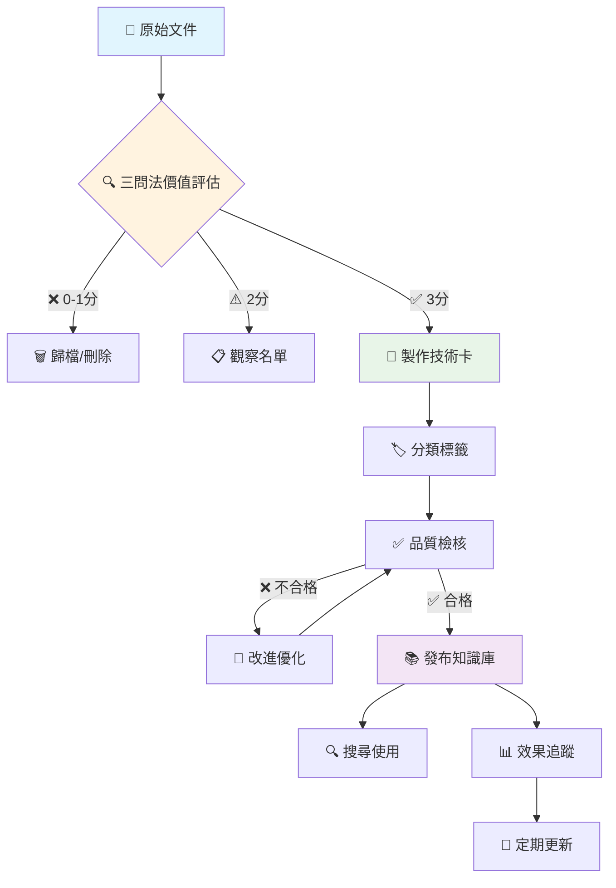

---

## 🔍 階段1：文件價值評估 (5分鐘)

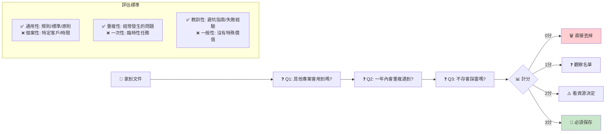

---

## 📝 階段2：技術卡製作 (15分鐘)

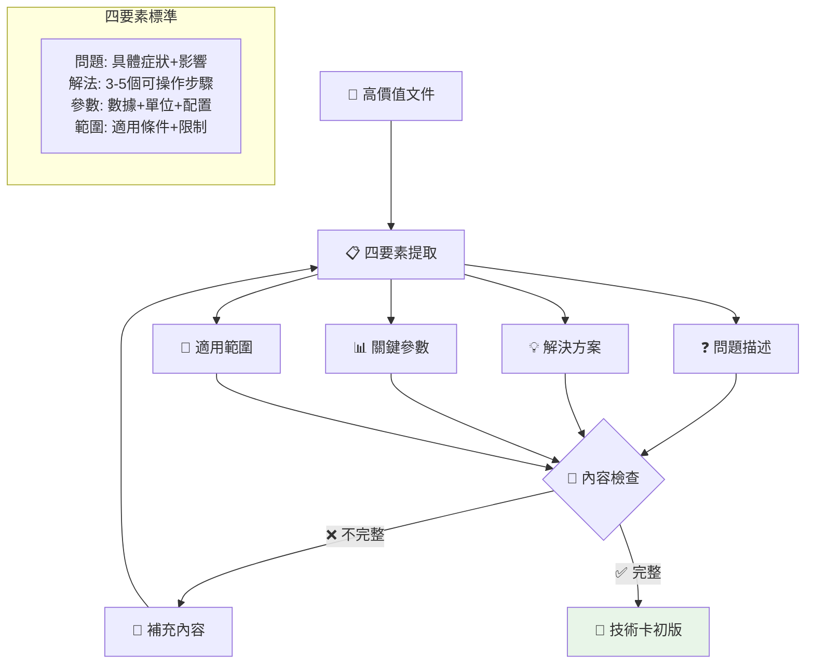

---

## 🏷️ 階段3：分類標籤 (2分鐘)

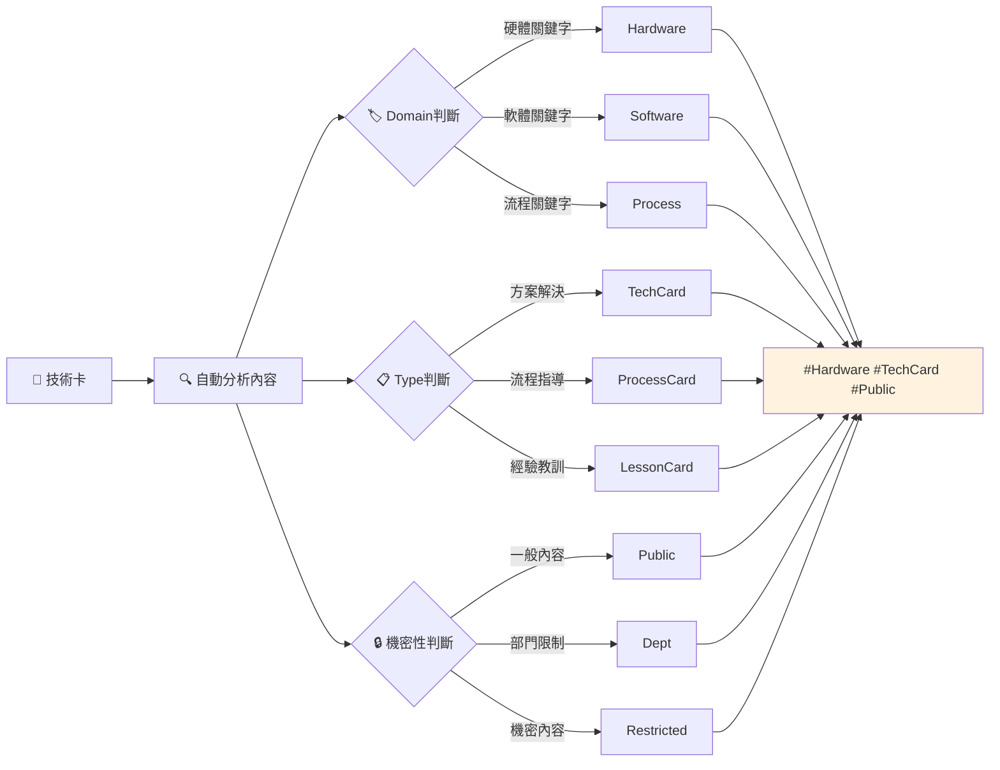

---

## ✅ 階段4：品質檢核 (3分鐘)

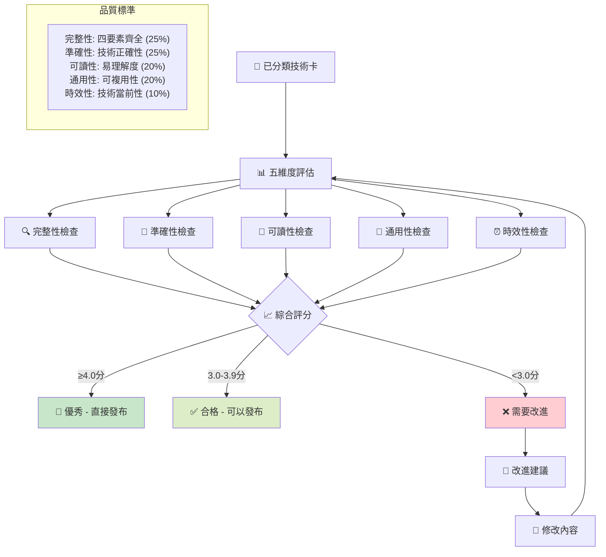

---

## 📚 階段5：發布知識庫 (1分鐘)

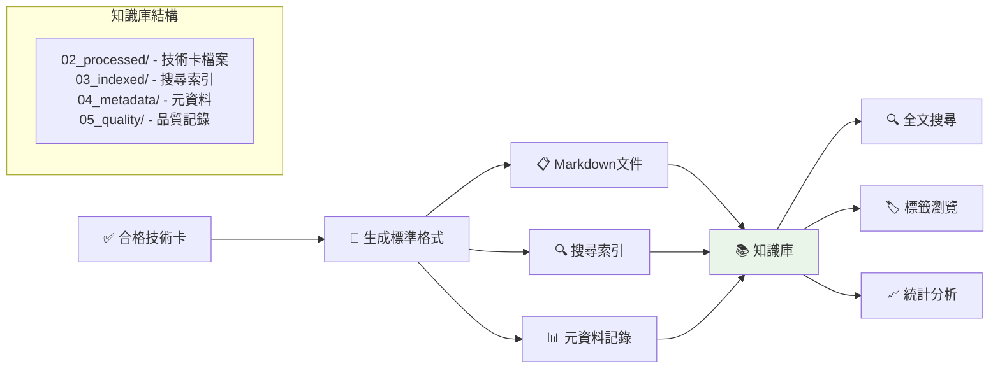

---

## 🔄 階段6：使用與迭代 (持續)

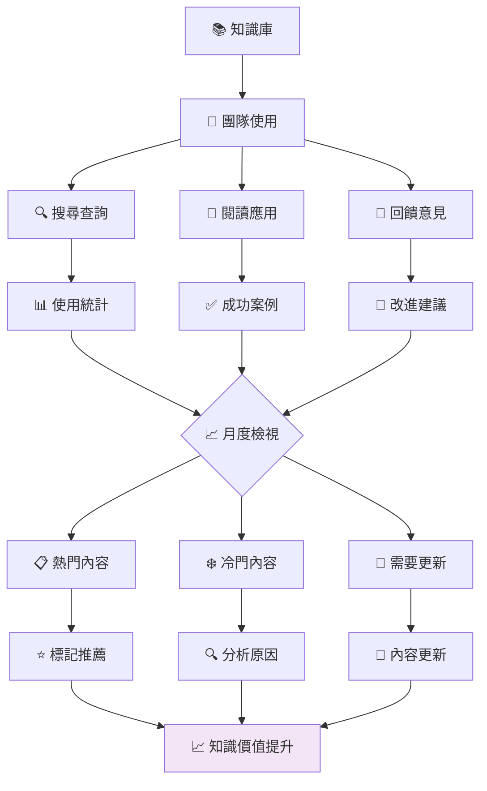

---

## 🎯 關鍵決策節點

### 1. 價值評估決策點
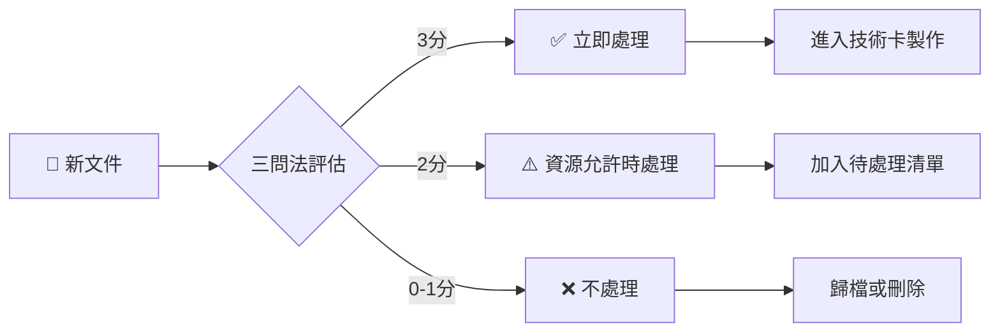

### 2. 品質檢核決策點
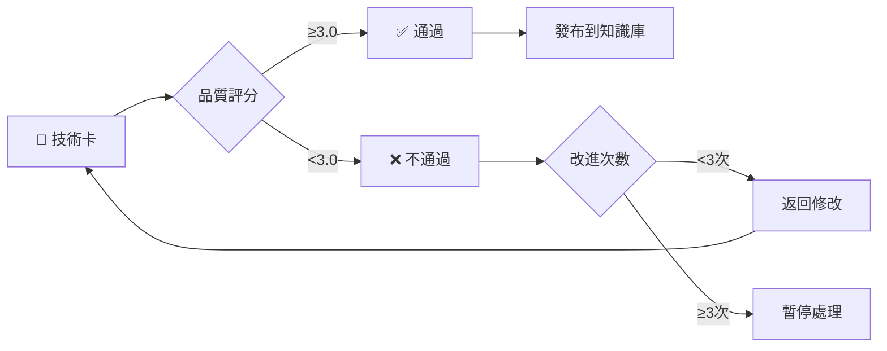

### 3. 使用效果決策點
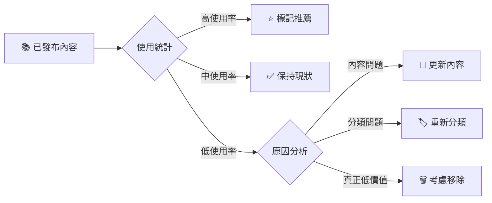

---

## ⏰ 時間控制要點

### 🚀 快速循環原則
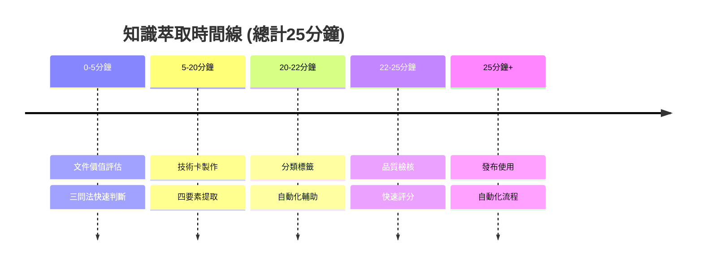

### ⚡ 效率提升要點
- **5分鐘法則**: 價值評估不超過5分鐘
- **15分鐘法則**: 技術卡製作控制在15分鐘內
- **批次處理**: 同類文件集中處理
- **模板重用**: 標準化格式減少思考時間

---

## 🔧 工具輔助流程

### 手工階段工具
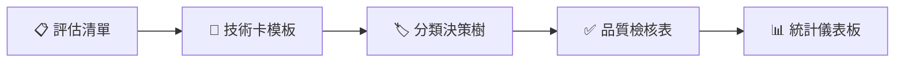

### 自動化階段工具 (可選)
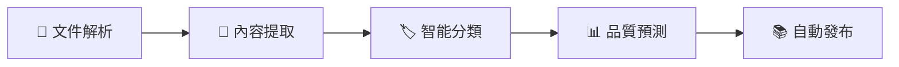

---

## 💡 核心設計原則

### 🎯 簡化優先
- **最小可行流程**: 核心5步驟，每步都有明確產出
- **快速決策**: 2-3個標準就能做出判斷
- **即時回饋**: 每個階段都有立即可見的結果

### 🔄 持續改進
- **數據驅動**: 基於使用統計優化流程
- **用戶回饋**: 收集實際使用經驗
- **定期檢視**: 月度流程優化會議

### 📈 價值導向
- **質量優於數量**: 寧可少而精，不要多而雜
- **實用性檢驗**: 是否真的幫助解決問題
- **投資回報**: 時間投入vs價值產出的平衡

---

**🎯 記住：這個流程圖的核心是「讓知識萃取變得簡單、快速、有效」**

*最後更新：2025-11-17 | 適用範圍：簡化版教學系統*