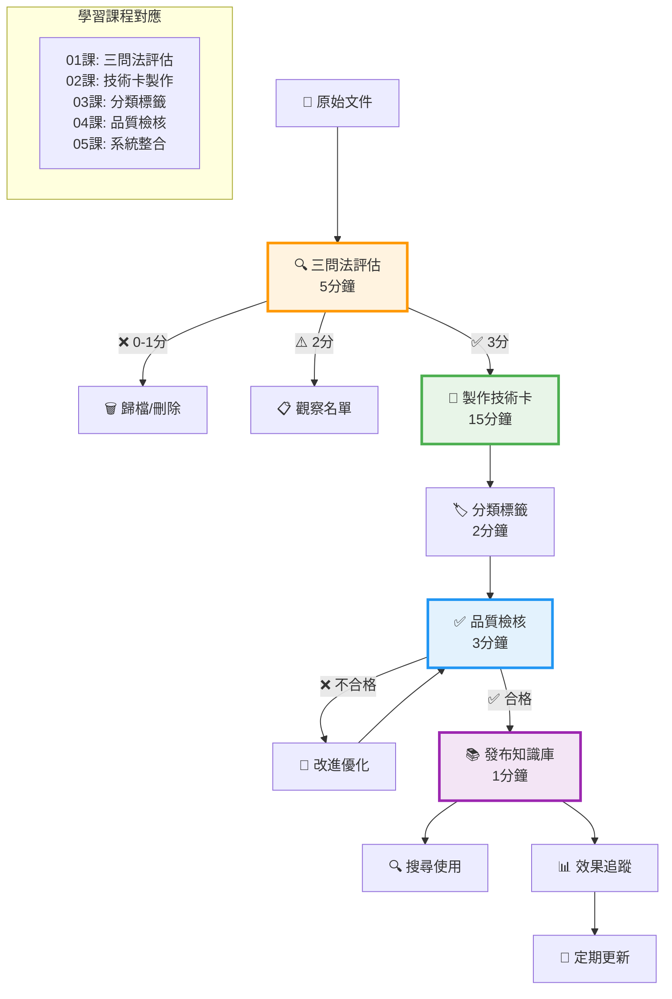
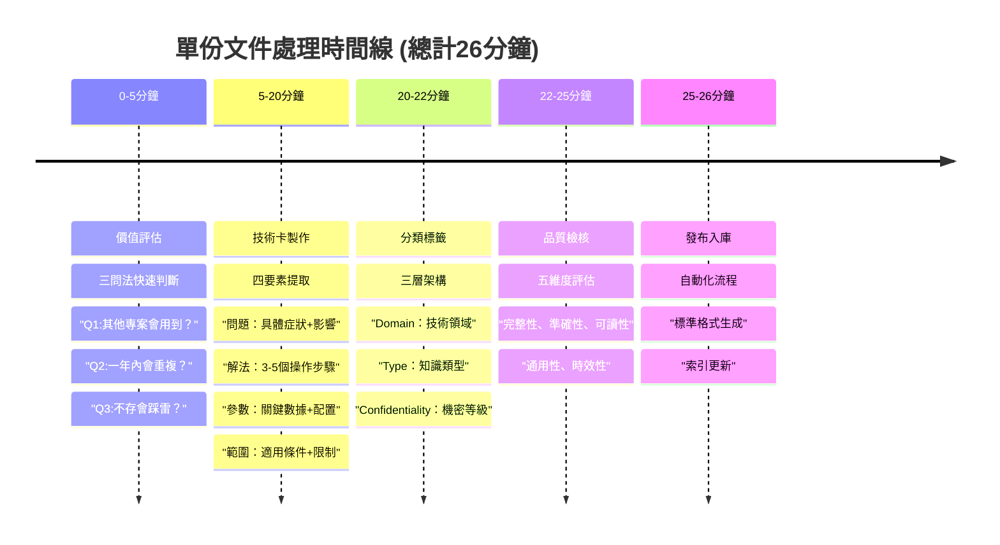
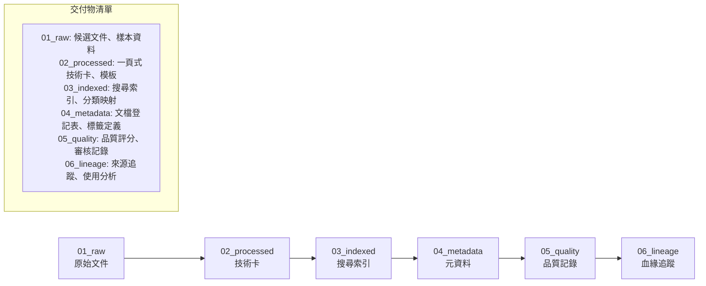
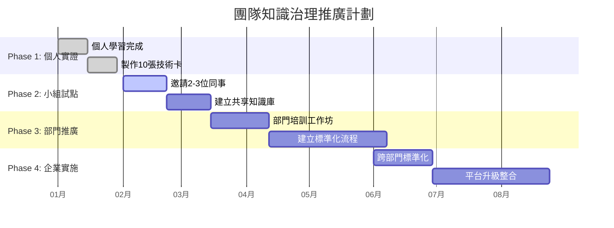

# 📚 簡化版知識治理教學系統

> **設計理念**: 遵循 Linus + Elon 5步驟，化繁為簡的知識治理學習之旅

---

## 🎯 課程概覽

### 📖 核心課程 (5門必修)
| 課程 | 時間 | 學習目標 | 核心產出 |
|------|------|----------|----------|
| [01_認識你的文件](./01_認識你的文件.ipynb) | 5分鐘 | 三問法價值判斷 | 文件評估清單 |
| [02_一頁式技術卡](./02_一頁式技術卡.ipynb) | 15分鐘 | 四要素知識濃縮 | 3張技術卡 |
| [03_建立分類標籤](./03_建立分類標籤.ipynb) | 10分鐘 | MECE三層分類 | 分類架構圖 |
| [04_品質自檢表](./04_品質自檢表.ipynb) | 10分鐘 | 五維度品質評估 | 品質檢核SOP |
| [05_從混亂到治理](./05_從混亂到治理.ipynb) | 20分鐘 | 端到端系統建立 | 完整治理流程 |

### 🤖 進階課程 (1門可選)
| 課程 | 時間 | 前置條件 | 學習目標 |
|------|------|----------|----------|
| [99_進階自動化](./99_進階自動化.ipynb) | 30分鐘 | 前5課完成+流程穩定1月 | 三階段自動化策略 |

---

## 🔄 知識萃取核心流程

### 📊 總體流程圖

### ⏰ 時間控制要點

---

## 🎯 核心設計原則

### 🔥 Elon Musk 5步驟應用

1. **🤔 質疑需求** (01課)
   - **原則**: 每個文件都要問「真的需要保存嗎？」
   - **工具**: 三問法評估框架
   - **口訣**: 「先問為什麼，再決定要不要存」

2. **🗑️ 刪除多餘** (02課)
   - **原則**: 把冗長報告濃縮成可複用精華
   - **工具**: 四要素技術卡框架
   - **口訣**: 「一頁說清楚，勝過十頁看不懂」

3. **🎯 簡化優化** (03課)
   - **原則**: 用最簡邏輯讓知識有唯一歸屬
   - **工具**: MECE三層分類架構
   - **口訣**: 「簡單分類，快速定位，持續優化」

4. **⚡ 加快週期** (04課)
   - **原則**: 建立快速有效的品質檢核機制
   - **工具**: 五維度品質評估
   - **口訣**: 「快速檢核，客觀評估，持續改進」

5. **🤖 最後自動化** (99課)
   - **原則**: 流程穩定後才考慮工具自動化
   - **工具**: 三階段自動化策略
   - **口訣**: 「人工流程跑順了，才配擁有自動化」

---

## 📁 階段目錄交付物

### 🗂️ 六階段知識治理流程

### 📋 各階段具體交付物

| 階段目錄 | 主要交付物 | 負責角色 | 更新頻率 |
|----------|------------|----------|----------|
| **01_raw** | 候選文件清單、收集日誌 | 專案成員 | 專案結束後 |
| **02_processed** | 技術卡(.md)、品質報告 | 原作者 | 隨技術卡產出 |
| **03_indexed** | search_index.json、category_map.json | 系統自動 | 新卡發布時 |
| **04_metadata** | document_registry.csv、tag_definitions.json | 管理員 | 每週彙整 |
| **05_quality** | quality_scores.csv、review_comments.json | 審核者 | 品質檢核後 |
| **06_lineage** | source_mapping.json、usage_analytics/ | 系統追蹤 | 持續更新 |

---

## 🚀 學習路徑建議

### 📈 個人學習路徑 (1週)

```mermaid
gantt
    title 個人知識治理學習計劃
    dateFormat  X
    axisFormat %s

    section 第1天
    01課-認識文件    :done, des1, 0, 5

    section 第2天
    02課-技術卡     :done, des2, 5, 15

    section 第3天
    03課-分類標籤   :done, des3, 15, 10

    section 第4天
    04課-品質檢核   :done, des4, 25, 10

    section 第5天
    05課-系統整合   :done, des5, 35, 20

    section 第6-7天
    實作練習       :active, des6, 55, 20
```

### 👥 團隊推廣路徑 (6個月)

---

## 💡 成功要素檢核

### ✅ 個人層面
- [ ] 完成5門核心課程學習
- [ ] 製作至少10張高品質技術卡
- [ ] 建立個人知識管理習慣
- [ ] 至少1次成功應用他人技術卡解決問題

### ✅ 團隊層面
- [ ] 2-3人小組試點成功
- [ ] 建立標準化流程與模板
- [ ] 月度知識治理例會運作
- [ ] 團隊知識庫達50+張技術卡

### ✅ 企業層面
- [ ] 跨部門標準化推廣
- [ ] 建立治理委員會與制度
- [ ] 企業知識庫規模500+張
- [ ] 新人學習曲線縮短30%+

---

## 🎉 開始你的學習之旅

### 🚀 第一步行動
1. **立即開始**: [點擊進入01課](./01_認識你的文件.ipynb)
2. **準備材料**: 找10份工作相關文件待評估
3. **時間安排**: 每天15-20分鐘，一週完成核心課程

### 💪 堅持要點
- **小步快跑**: 每課都有立即可見的成果
- **即學即用**: 學完立刻應用到實際工作中
- **持續改進**: 根據使用效果調整方法

### 🎯 最終目標
> 讓知識治理變成像「開例會」一樣的團隊常規動作，
> 讓每個人的經驗和智慧都能成為團隊的共同資產。

---

**🔑 記住核心口訣**：
1. 「先問為什麼，再決定要不要存」
2. 「一頁說清楚，勝過十頁看不懂」
3. 「簡單分類，快速定位，持續優化」
4. 「快速檢核，客觀評估，持續改進」
5. 「人工流程跑順了，才配擁有自動化」

**現在就開始你的知識治理學習之旅吧！** 🚀

---

*📚 課程系列：企業知識治理實戰 | 🏷️ 標籤：簡化版教學、流程圖、知識萃取 | 📅 建立日期：2025-11-17*